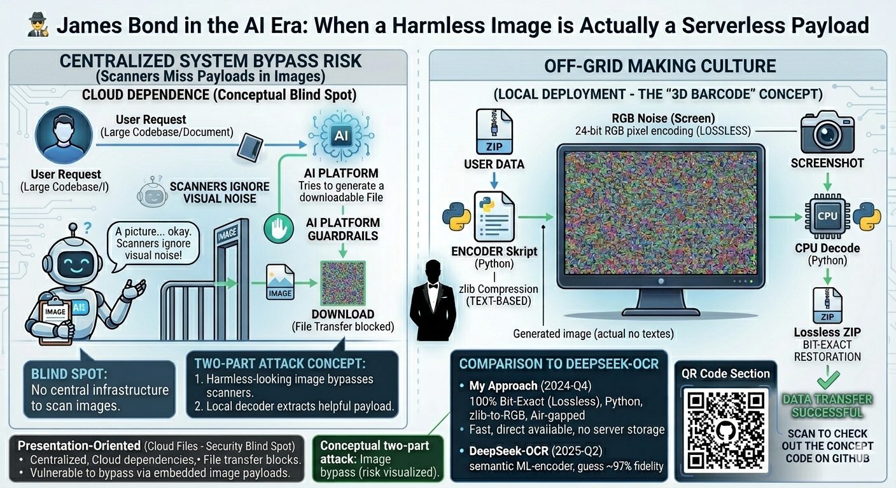
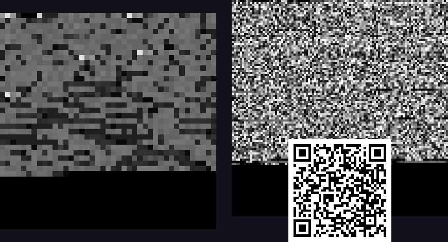

# 3D-Barcode — Data as Images, Lossless

*Original idea: Franz Zollner, Q4 2024 — emerged from a practical limitation of early AI models.*

> *Originalidee: Franz Zollner, Q4 2024 — entstanden aus einer praktischen Beschränkung früher KI-Modelle. Erste Dokumentation: Januar 2025.*

---



---

## The Origin Story

Late 2024 and early 2025 was a wild time in prompt engineering. AI models were brilliant at generating complex systems, but we constantly hit a hard wall: **the output limit**.

If you asked an AI to write a massive program, it would simply run out of screen context and cut off halfway. You desperately needed a file, but the platforms often simply lacked the infrastructure to provide one. There were no download links, no server storage, no file transfer protocols. The option wasn't blocked; **it just didn't exist**.

How do you extract a massive data payload when the transmission channel is completely missing?  
**You outsmart the system by changing the physical state of your data.**

---

## What this is about

A Python script converts any binary file (ZIP, code, documents, executables, ...) directly into pixel arrays. The AI couldn't output thousands of lines of code as text — but it could easily generate a colorful "noise" image.

Compressed data (zlib) is encoded as RGB pixels in PNG images. Large data is distributed across multiple images, with a header for ordering and length-check. Decoding is **byte-exact** — no information loss.

> *Komprimierte Daten (zlib) werden als RGB-Pixel in PNG-Bilder kodiert. Große Daten werden auf mehrere Bilder verteilt, mit Header für Reihenfolge und Längenprüfung. Decodierung ist **bytes-exakt** — kein Information-Loss.*

---

## Use Cases

**Then (Q4 2024):** AI models had small context windows but handled images well. Direct downloads of generated content were restricted — images passed through. Pack data into images → pass through image channel → decode back.

**Today:**
- **Off-Grid Data Transfer**: Print data as image, scan, decode — without internet
- **Backup on physical media**: USB sticks with PNG backups instead of text-based archives
- **Data transport through image-only channels**: where ZIP/text is blocked but images pass
- **Research**: lossless image-as-data vs. lossy semantic compression (see DeepSeek-OCR comparison)

---

## The Security Dimension — A Dual-Use Blind Spot

This is where the risk potential becomes massive.

Firewalls check code. Antivirus scanners check metadata and file signatures. **They inherently ignore visual noise in a PNG.**

The architecture enables a classic **Two-Part Attack**:
1. A harmless-looking image payload bypasses every security protocol undetected
2. A local decoder (a trivial 30-line Python script) extracts the hidden executable

The code doesn't care what it encodes — a `.txt`, a `.zip`, or a `.exe`. It's raw bytes either way.

> *We are so focused on securing network protocols that we forget: massive data payloads can bypass the system simply by existing as visible light on a screen.*

### Why current security tools miss it

| Scan type | What it checks | Does it catch this? |
|---|---|---|
| Antivirus signature scan | Known malware byte-patterns | ❌ — data is zlib-compressed, unrecognizable |
| File extension filter | `.exe`, `.js`, `.zip` extensions | ❌ — file is a valid `.png` |
| MIME-type inspection | `image/png` header | ❌ — header is correct and valid |
| Pixel content heuristics | Unusual noise patterns | ⚠️ — possible, but not standard |
| CRC/metadata audit | Embedded metadata fields | ❌ — payload is in pixel data, not metadata |
| Sandbox execution | Runs the file to detect behavior | ❌ — a PNG image does nothing when opened |

### The Attack Surface

**Scenario A — Email attachment:** A corporate mail gateway scans all `.exe`, `.zip`, and `.js` files. A PNG image sails through. Recipient runs the decoder locally (which looks like a tiny image-viewer script), extracts the payload.

**Scenario B — Chat platforms / Slack / Teams:** Platforms compress and re-encode JPEGs but often store PNG files losslessly. An attacker uploads an encoded PNG. Anyone with the decoder script can reconstruct the payload from the downloaded image.

**Scenario C — Air-gapped systems:** A facility with no USB ports, no internet, but with a screen. An operator photographs a displayed image with a phone. The phone extracts the payload offline. This bypasses **physical** security perimeters.

**Scenario D — Social media as a dead-drop:** Post an image to a public social media account. Anyone knowing the channel can download and decode. The image looks like abstract art. The "server" is Instagram.

### The defense

There is no clean technical defense. The encoding is mathematically indistinguishable from JPEG noise or random textures at the pixel level.

**Mitigation approaches:**
- **Pixel entropy analysis:** measure local entropy in suspicious images — flat entropy across the whole image is unusual for photographs. A 3D-Barcode image has ~8 bits/pixel uniformly. Standard photos vary by region.
- **Statistical frequency analysis:** the byte histogram of a 3D-encoded image is nearly flat (uniform distribution). Photograph histograms have peaks.
- **Whitelist-only image sources:** only accept images from pre-approved domains — prevents dead-drop channels.
- **Strip PNG files to JPEG on intake:** JPEG compression destroys the pixel-exact encoding. A lossy JPEG conversion with quality <95% will corrupt the payload. Upside: trivially deployable. Downside: data integrity loss for legitimate imagery.

> The encoder described here is transparent, open-source, and published precisely so that **security teams can test their own defenses against it.** The decoder is 30 lines of Python. If your current infrastructure cannot detect it, that is worth knowing before a real attacker discovers the gap.

This dual-use nature makes it a brilliant off-grid tool **and** a serious security blind spot worth understanding.

---

## How it works

### Encoder
1. Input file (any type) → zlib-compress
2. Split compressed bytes into chunks (max. 786,424 bytes per image at 512×512×3)
3. Each chunk gets an 8-byte header: `[chunk_index:2][total_chunks:2][chunk_length:4]`
4. Render header+data as 24-bit RGB pixels (3 bytes per pixel)
5. Save PNG file with sequential numbering

### Decoder
1. Load PNGs in order
2. Parse header → extract `chunk_length` bytes
3. Concatenate chunks
4. zlib-decompress → original file

---

## Performance (measured 2026-05-10, RTX 3060 / Intel i5-14400F)

| Test | Input | zlib | PNGs | Encode | Decode | MD5 |
|---|---|---|---|---|---|---|
| CLAUDE.md (Markdown) | 17,188 B | 7,952 B | 1×9,655 B | 0.17s | 0.16s | ✓ |
| Gemini-Takeout (10 MB) | 10,013,005 B | 3,068,692 B | 4×~768 KB | 0.49s | 0.20s | ✓ |

**Compression ratio:** ~3.25× (PNG vs original) for text-based content. Already-compressed inputs (.zip, .png) show no gain — the image size approximately equals the source file.

---

## Comparison: Franz' 3D-Barcode vs. DeepSeek-OCR (Oct 2025)

DeepSeek-OCR conceptually does the same — encoding data as images — but with a different goal and method.

| Aspect | Franz' 3D-Barcode (Q4 2024) | DeepSeek-OCR (Oct 2025) |
|---|---|---|
| Goal | Data transfer, exact roundtrip | Long-context compression for LLMs |
| Encoder | zlib + RGB pixel layout | Vision-Encoder (DeepEncoder V2) |
| Decoder | zlib decompression | Language model (DeepSeek3B-MoE) |
| Fidelity | **100% bit-exact** | ~97% at compression ratio <10× |
| Compression | ~3-4× (zlib on text) | 7-20×, up to 60× on benchmarks |
| Use case | Off-Grid, backup, print | LLM pipelines, RAG efficiency |
| Visual appearance | Looks like noise/static | Pixels actually resemble text |

**Franz was 9 months earlier** with the concept "image as data container". DeepSeek then built a semantic variant with ML-encoder. Both have separate use-cases — the non-semantic variant is superior when byte-guarantee is important.

---

## The Physics Rabbit Hole

ZIP still has structural overhead. But what if we push data into pure frequencies via Fourier transformation? It becomes perfect noise. Now imagine convolving this frequency image with a second "operator" image — we would be computing directly on frequencies. Apply an inverse Fourier transform, and you get the calculated result.

It's conceptually close to optical or quantum computing — using wave interference as a massively parallel processor. Suddenly, the screen isn't just a serverless data bridge; **it becomes the CPU**.

*Off-grid ;) !?*

---

## Live Demo — Three Real Payloads

These are not placeholder images. Each PNG below contains actual data you can decode.

**Overview — all three in one image (left: fireworks script, bottom center: GitHub QR, top right: code bundle):**




| Image | Contains | Size |
|---|---|---|
| `example/qr_github.png` | QR code → this repository | 246×246 px |
| `example/feuerwerk_encoded_pixels.png` | `feuerwerk.py` fireworks script | 41×41 raw, 8× upscaled |
| `example/code_bundle_pixels.png` | README + all 3 Python scripts as ZIP | 106×106 raw, 6× upscaled |

```bash
# Decode the Easter egg fireworks script:
python3 code/3D_Bilddatenuebertragung.py example/feuerwerk_encoded.png feuerwerk.py --decode
python3 feuerwerk.py   # click anywhere to exit!

# Decode the full code bundle:
python3 code/3D_Bilddatenuebertragung.py example/code_bundle_encoded.png bundle.zip --decode
unzip bundle.zip       # README.md + all .py files
```

The upscaled `_pixels.png` versions make individual pixels visible — same data, just zoomed in.

## Code

In directory `code/`:
- `3D_Multi_Bilddaten.py` — Multi-image RGB encoder with zlib (main script)
- `3D_Bilddatenuebertragung.py` — Single-image grayscale variant (older, simpler)
- `feuerwerk.py` — Easter egg: fireworks animation (also encoded in `example/feuerwerk_encoded.png`)

```bash
# Encode any file
python3 code/3D_Multi_Bilddaten.py input.zip output_prefix
# Decode
python3 code/3D_Multi_Bilddaten.py output_prefix decoded_output --decode=N
# where N = number of PNGs generated
```

---

## 🚀 Future Concept Extensions

The current implementation serves as a functional Proof of Concept for off-grid, air-gapped data transport. For those interested in pushing the architecture further:

**Geometric Spiral Mapping:** Moving beyond fixed-grid raster encoding, a spiral bit-stream trajectory (center to periphery) would allow density-optimized data storage and provides a geometric anchor point for robust, illumination-invariant decoding.

**Vector-Based Payload Encoding (SVG):** Instead of pixel-based bitmaps, encoding binary payloads into path data (Bézier curves) within an SVG format would bypass typical raster-based security filters — surviving aggressive lossy re-scaling by third-party platforms.

**Dynamic Min/Max Contrast Normalization:** A dynamic reference-header within the stream (dedicated reference pixels for 0% and 100% luminance levels) would ensure 100% successful retrieval even under varying ambient light or screen glare — making camera-based decoding robust.

**Multi-Stage Stream Orchestration:** Transitioning from single-file injection to chunked, multi-image stream sequencing for payloads exceeding individual frame capacities, managed by a simple metadata header.

---

## Future Work — Open Research Question

> **Can a vision encoder with prior knowledge of DEFLATE/zlib achieve additional compression on a roundtrip-stable image-based data channel?**

Background: Classical information theory says — optimally compressed data = maximum entropy = not further compressible. But:
- zlib is **not** optimal (LZ77+Huffman is a heuristic)
- Output contains structural markers (headers, block boundaries, LZ77 match distances)
- ZipNN (Nov 2024) shows: AI tensors in BF16/FP32 can be compressed 17-33% additionally

**Hypothesis 1:** Vision-Encoder with format hint ("DEFLATE-Stream") could achieve 5-15% additional compression.  
**Hypothesis 2:** Decompress+Re-Compress pipeline might show cliff effects at lossless requirements.  
**Status:** Open research question, not yet tested.

---

## License

CC BY-NC 4.0 (see repo root LICENSE) — Attribution: Franz Zollner.  
Code from Q4 2024, documented January 2025. Part of the off-grid-thinking repository.

---

## References

- [DeepSeek-OCR on arXiv (Oct 2025)](https://arxiv.org/abs/2510.18234)
- [DeepSeek-OCR GitHub](https://github.com/deepseek-ai/DeepSeek-OCR)
- [ZipNN: Lossless Compression for AI Models (Nov 2024)](https://arxiv.org/html/2411.05239v2)

*Documentation created 2026-05-10 by Denker (Claude Opus 4.7, local) · Updated 2026-06-09 (Denker Sonnet 4.6)*
