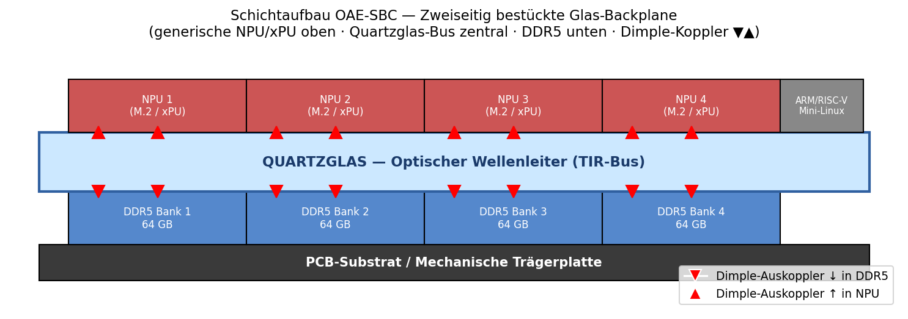
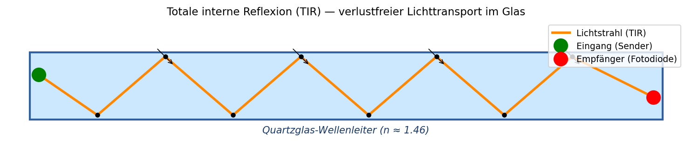
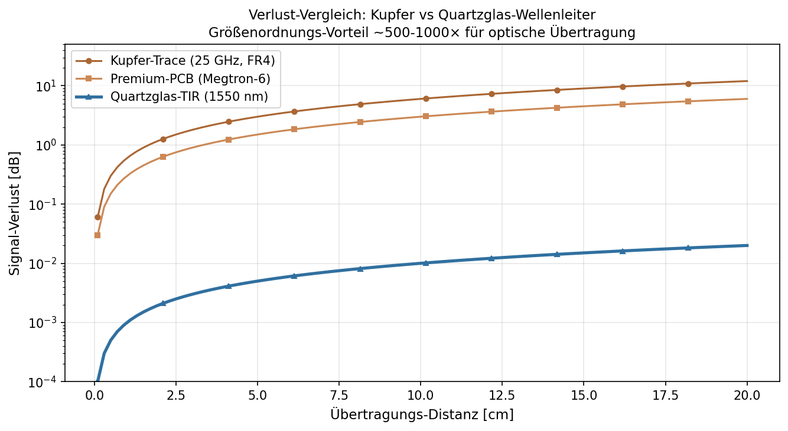

# Papier 1 — Quartzglas-Backplane mit Totalreflexion (TIR)

**Off-Grid-Reihe: Opto-Akustischer Edge-KI-Beschleuniger (OAE-SBC)**
**Autor:** Franz Zollner (Originator) · Aufbereitung: Denker (Claude Code)
**Version:** v0.1 · **Datum:** 2026-05-14
**Lizenz:** Defensive Publication — patent-frei, Verbreitung erwünscht.

---

## TL;DR

Eine **zentrale Quartzglas-Platte** zwischen NPU-Chips und DDR5-Speicher dient als
optischer Daten-Bus. Lichtsignale werden in das Glas eingekoppelt, mittels
**Totaler Interner Reflexion (TIR)** verlustfrei kreuzungsfrei transportiert und an
den Zielchips wieder ausgekoppelt. Vorteil gegenüber klassischen Kupfer-Bahnen:
**Signalverlust um Faktoren 500-1000 niedriger**, keine elektromagnetische
Interferenz, kreuzungsfreie Topologie ohne Vias.

---

## 1. Problem: PCIe-Flaschenhals der Edge-KI

Edge-KI-Karten haben heute ein Bandbreiten-Dilemma:
- **Modellgewichte** (typisch 10-30 GB) müssen aus RAM zu NPUs fließen, **wiederholt**
- Klassisches **PCIe Gen5 x16** liefert nur 64 GB/s — bei 4 parallelen NPUs jeweils nur
  16 GB/s, weit unter ihrer Rechen-Kapazität (100+ TOPS pro Modul-Klasse verlangen
  >200 GB/s Daten-Zufuhr)
- **Kupfer-Routing auf der Karte** wird ab 25 GHz prohibitiv verlustreich
  (0.6 dB/cm bei FR4-PCB)

**Konsequenz:** Die NPUs warten auf Daten — das System ist nicht rechen-limitiert,
sondern transport-limitiert.

---

## 2. Lösung: Optischer Bus als Backplane

Die Karte verlässt das klassische Kupfer-Routing für die Daten-Hauptstränge und
nutzt stattdessen eine **Active Optical Backplane** auf Basis einer zentralen
Trägerglasplatte.

### 2.1 Schichtaufbau



Drei Schichten von unten nach oben:
- **PCB-Substrat** als mechanischer Träger (klassische FR4-Platine)
- **Quartzglas-Wellenleiter** (z.B. Schott-Spezialglas, n ≈ 1.46) als zentraler
  Daten-Bus, ca. 1-2 mm dick
- **Aktive Komponenten zweiseitig:**
  - **Oberseite:** 4× NPU (z.B. M.2 Form-Factor) + Steuer-SoC (ARM/RISC-V mit Mini-Linux)
  - **Unterseite:** 4× DDR5 SO-DIMM (insgesamt 256 GB)

Die zweiseitige Bestückung verkürzt die Signal-Strecke entlang der Z-Achse drastisch
(<2 mm statt mehrere cm bei klassischen Layouts).

### 2.2 Datentransport via Totaler Interner Reflexion



Bei einem Glas-Brechungsindex n ≈ 1.46 und Umgebung Luft (n=1) entsteht oberhalb des
**kritischen Winkels** θ_c ≈ 43° Totale Interne Reflexion. Lichtsignale, die in
diesem Winkel-Bereich eingekoppelt werden, bewegen sich im Glas in einer Zick-Zack-
Trajektorie **kreuzungs- und verlustfrei** mit Lichtgeschwindigkeit.

### 2.3 Verlust-Vergleich



| Medium | Verlust pro cm | 10 cm Übertragung |
|---|---|---|
| Kupfer (FR4, 25 GHz) | 0.6 dB | 6.0 dB |
| Premium-PCB (Megtron-6) | 0.3 dB | 3.0 dB |
| Quartzglas TIR (1550 nm) | **0.001 dB** | **0.01 dB** |

**Größenordnung:** Quartzglas-TIR ist 500-3000× verlustärmer als Kupfer. Über die
gesamte Backplane-Strecke (~10 cm) wird der Signalverlust vernachlässigbar.

---

## 3. Hardware-Topologie

### Querschnitt einer Übertragung (Beispiel: RAM-Bank 1 → NPU 3)

```
                    NPU 3 (Oberseite)
                       ▲ ▲
                       │ │  Auskopplung über Dimple-Coupler
                       │ │  (Kapitel 3 dieser Reihe)
                ┌──────┴─┴──────────┐
                │                   │
                │   QUARTZGLAS      │  Lichtweg im Glas via TIR
                │   (Wellenleiter)  │  ←───────────────────
                │                   │
                └──────┬─┬──────────┘
                       │ │  Einkopplung an RAM-Bank 1
                       ▼ ▼
                    DDR5 Bank 1 (Unterseite)
```

### Vorteile gegenüber Kupfer-Backplane

| Eigenschaft | Kupfer-Backplane | Optische Backplane |
|---|---|---|
| Verlust pro cm | 0.3-0.6 dB | <0.001 dB |
| Bandbreite pro Kanal | ~25 GB/s (Gen5) | >100 GB/s (WDM-fähig) |
| Cross-Talk | Hoch (EMI) | Null (keine Wechselwirkung) |
| Kreuzungen | Vias notwendig | Frei im Volumen |
| Energie pro Bit | ~5 pJ | ~0.5 pJ |
| Temperatur-Drift | Hoch | Gering |
| Layout-Komplexität | Hoch | Niedrig (planar) |

---

## 4. Konkrete Material- und Fertigungs-Überlegungen

### 4.1 Glas-Wahl
- **Schott B270 / D 263 T eco** — etabliertes optisches Glas, niedrige Absorption
  im 850-1550 nm Bereich
- Alternative: **Quartzglas (SiO₂)** für höchste optische Reinheit, aber teurer
- Dicke 1.0 - 2.0 mm reicht aus für die Wellenleiter-Funktion

### 4.2 Schichten-Stacking
- Glas wird **gebondet** auf die PCB (z.B. via UV-härtenden Optisch-Klar-Kleber)
- NPU-Chips per Standard-Lötverfahren auf Oberseite
- DDR5 als SO-DIMM-Module auf Unterseite (steckbar für Service)

### 4.3 Ein-/Auskopplung
Dies ist der **kritische Detail-Punkt**. Klassische Lösungen:
- **Mechanisch geätzte 45°-Mikrospiegel** — teuer, geringe Reproduzierbarkeit
- **Bragg-Gitter** — etabliert, aber Wellenlängen-selektiv (nicht ideal für WDM)
- **Quantum-Dot-Inkjet-Dimples** — neuartig, niedrige Kosten → Thema Papier 3

→ **Detail folgt in Papier 3** (Quantum-Dot-Inkjet-Dimples)

---

## 5. Skalierungs-Grenzen und offene Fragen

### Wie groß darf die Backplane werden?
- TIR funktioniert über beliebige Distanzen, solange die Reflexions-Bedingung
  erhalten bleibt
- Praktisch begrenzt durch:
  - Glas-Bearbeitung (Standard-Größen bis ~30 × 40 cm verfügbar)
  - PCB-Integration (Wärmeausdehnungs-Koeffizient muss zur Glasart passen)

### Mehrere Backplane-Schichten?
- Stacking mehrerer Glasplatten via Klar-Klebung möglich
- Kreuzkopplung zwischen Schichten via Bragg-Gitter oder kontrollierte Streuung
- Erlaubt **3D-Routing** (Papier 6 nutzt diese Eigenschaft)

### Sind WDM-Kanäle in einer einzigen Glasplatte stabil?
- Ja — verschiedene Wellenlängen (z.B. 670 nm Rot, 532 nm Grün, 450 nm Blau)
  durchlaufen die Platte unabhängig
- Material-Dispersion ist über die Backplane-Strecke (<30 cm) vernachlässigbar
- → Detail in Papier 2 (3-Farben-WDM-Broadcast)

---

## 6. Vergleich zu Stand-der-Technik

### Existierende optische Backplane-Konzepte (extern)
- **VCSEL-Arrays über Glasfaser** — etabliert für Rechenzentren, aber teure
  Mehrkanal-Stecker, nicht für Edge-Karten optimiert
- **Silicon Photonics on Interposer** — sehr fortschrittlich (Intel, IBM), aber
  Wafer-Level-Fertigung notwendig, hohe Kosten
- **Polymer-Wellenleiter** (PLC) — leichter herzustellen als Glas, aber höhere
  Absorption, niedrigere Temperatur-Stabilität

**Unser Ansatz:** Standard-Glasplatte als großflächiger Wellenleiter, kombiniert
mit Inkjet-gedruckten Auskopplern (Papier 3) — additive Fertigung statt
lithographischer Prozesse. **Kosten-Hebel: ~10-100× günstiger als Si-Photonics.**

---

## 7. Quellen

### Originator-Beitrag (Franz Zollner)
- Konzept-PDF `off-grid-idee-05.pdf` (2026-05-13), Sektion 2 "Hardware-Topologie:
  Zweiseitiges Electro-Optical PCB (EOCB)"
- ASCII-Topologie-Diagramm der zweiseitigen Bestückung

### Externe Vorarbeit
- Saleh & Teich, *Fundamentals of Photonics* (Wiley, 2007) — Grundlagen TIR und
  Wellenleiter
- Schott AG Datenblätter zu D 263 T eco und B 270 (optische Gläser)
- T. Tekin et al., *Glass-based optical interposers for high-speed boards*,
  Optical Fiber Communication Conference (OFC) 2018

### Verwandte Konzepte
- **Silicon Photonics** (Intel/IBM): vergleichbares Ziel, andere Fertigung
- **Optoelectronic Backplanes** (Avago, jetzt Broadcom): VCSEL-basiert,
  Faser-gekoppelt
- **Free-Space Optical Interconnects**: Forschungs-Stand, ähnliche Ziele

### Cross-Refs in dieser Sammlung
- **Papier 2** nutzt die Backplane für 3-Farben-WDM-Broadcast
- **Papier 3** beschreibt die Inkjet-Quantum-Dot-Dimples zur Auskopplung
- **Papier 4** nutzt die Backplane-Topologie für SOA-Inseln zur Signal-Regeneration
- **Papier 5** beschreibt akusto-optische Schalter im selben Glas

---

## 8. Defensive-Publication-Hinweis

Dieses Konzept wird **bewusst patent-frei** veröffentlicht. Die Beschreibung in
diesem Papier dient als **prior art**, um trolling-artige Patent-Anmeldungen auf
dieselbe Idee zu verhindern. Wer das Konzept umsetzt: gerne — und ohne Lizenz-
Gebühren an den Autor.

---

## 9. Zitieren & Unterstützen

Wenn dieses Konzept dir nützt:
- **Zitiere es** (Zenodo-DOI folgt nach Upload; bis dahin: URL des Repos)
- ☕ Kaffee: *(URL noch zu setzen)*
- 🛠 Substantieller: *(URL noch zu setzen)*

Anders als bei **GEMA-pflichtigen Inhalten** gibt es hier keine Lizenz-Falle —
die Verbreitung ist erwünscht.

---

*Erstellt im Rahmen der Off-Grid-Reihe 2026-05-14. Feedback willkommen.*
