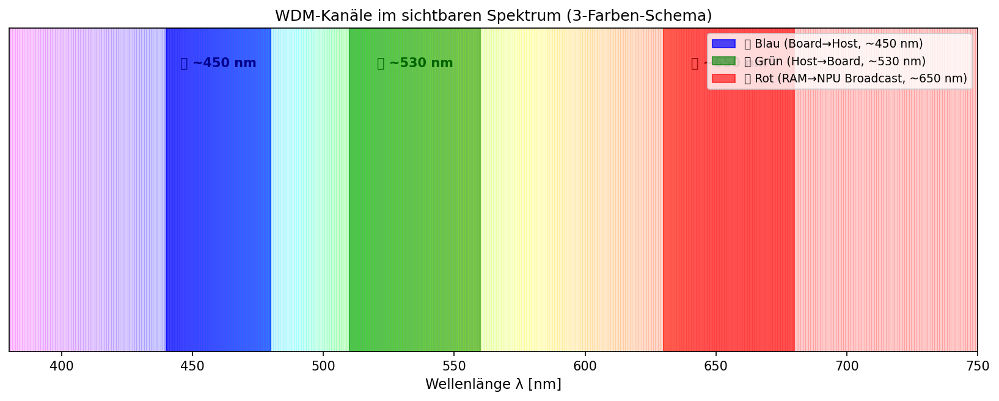
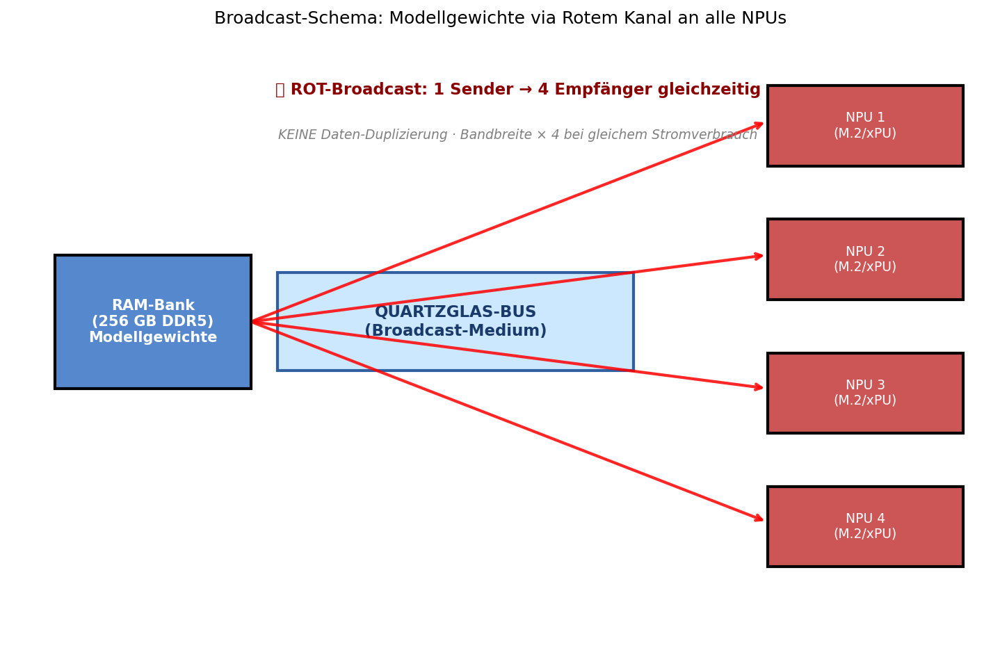
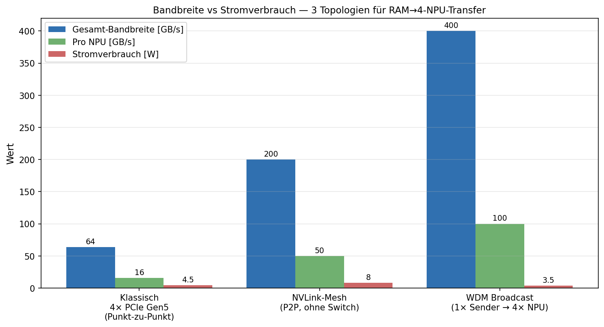

# Papier 2 — 3-Farben WDM-Broadcast für Edge-KI-Beschleuniger

**Off-Grid-Reihe: Opto-Akustischer Edge-KI-Beschleuniger (OAE-SBC)**
**Autor:** Franz Zollner (Originator) · Aufbereitung: Denker (Claude Code)
**Version:** v0.1 · **Datum:** 2026-05-14
**Lizenz:** Defensive Publication — patent-frei, Verbreitung erwünscht.

---

## TL;DR

Drei dedizierte Lichtkanäle in einem gemeinsamen Quartzglas-Bus, getrennt nach
Wellenlänge (Wavelength Division Multiplexing, WDM): **🟢 Grün** für Eingaben vom
Host, **🔴 Rot** für Modellgewichte-Broadcast an alle NPUs, **🔵 Blau** für Antworten
zurück zum Host. Der entscheidende Hebel: der rote Kanal ist ein **Broadcast-Medium**
— eine einzige Übertragung erreicht alle 4 NPUs gleichzeitig. Daten-Duplizierung
entfällt, die effektive Bandbreite vervielfacht sich bei gleichbleibendem
Stromverbrauch.

---

## 1. Problem: Daten-Duplizierung bei Modellgewichten

Bei klassischer Punkt-zu-Punkt-Topologie (z.B. PCIe oder NVLink-P2P) müssen
Modellgewichte **viermal** über den Bus geschoben werden, einmal pro NPU. Das ist:

- **Strom-ineffizient**: jeder Transfer kostet ~0.5-5 pJ pro Bit
- **Bandbreiten-limitiert**: 64 GB/s PCIe Gen5 × 16 wird in 4 Streams aufgeteilt
  → effektiv 16 GB/s pro NPU
- **Zeit-versetzt**: bei sequenzieller Übertragung warten NPUs auf ihre Reihe

Bei Modell-Größen von 10-30 GB und Batch-Verarbeitung wird das zum kritischen
Engpass — die NPUs könnten 100+ TOPS leisten, bekommen aber nur ~20% Auslastung.

---

## 2. Lösung: Wellenlängen-Multiplexing als Broadcast-Architektur

### 2.1 Die drei Farbkanäle



| Kanal | Wellenlänge | Richtung | Zweck |
|---|---|---|---|
| 🟢 Grün | ~530 nm | Host → Board | Eingaben, Prompts, Sensordaten |
| 🔴 Rot | ~650 nm | RAM → NPU **(Broadcast)** | Modellgewichte |
| 🔵 Blau | ~450 nm | Board → Host | Antworten, Inferenz-Ergebnisse |

Die drei Wellenlängen propagieren **unabhängig** durch denselben Quartzglas-Bus
(Papier 1). Material-Dispersion über ~30 cm Backplane-Distanz ist
vernachlässigbar.

### 2.2 Broadcast-Mechanismus für den roten Kanal



Im roten Kanal arbeitet das System wie ein **WiFi-Broadcast im Terahertz-Bereich**:

1. Ein einziger Sender (Inkjet-Quantum-Dot-Auskoppler an der RAM-Bank) injiziert
   die Modellgewichte als rote Lichtsignale in das Glas
2. Das Licht propagiert via Totaler Interner Reflexion (Papier 1) durch den
   Wellenleiter
3. **Alle 4 NPU-Auskoppler oberhalb empfangen das Signal simultan** — jeder
   NPU-Fotodiode bekommt parallel die gleichen Modellgewichte

**Pointe:** keine Daten-Duplizierung. Was bei Punkt-zu-Punkt 4× Bus-Zeit kostet,
braucht hier 1× Bus-Zeit. Die NPUs sehen dieselben Daten gleichzeitig — ideal
für synchrone Inferenz-Batches.

### 2.3 Warum funktioniert WDM in einem Bus?

Drei Wellenlängen-Eigenschaften wirken zusammen:

1. **Spektrale Trennung:** 200 nm Abstand zwischen Rot und Blau → keine
   Wechselwirkung in linearem Material wie Quartzglas
2. **Wellenlängen-selektive Auskopplung:** Quantum-Dot-Dimples (Papier 3) sind
   für bestimmte Wellenlängen optimiert — der grüne Auskoppler ignoriert rotes
   Licht und umgekehrt
3. **Polarisations-Unabhängigkeit:** alle drei Kanäle sind unpolarisiert oder
   einheitlich linear — keine Doppelbrechung-Effekte im isotropen Glas

---

## 3. Bandbreiten-Vergleich



Drei Topologien für den 256-GB-RAM-zu-4-NPU-Pfad:

| Topologie | Gesamt-Bandbreite | Pro NPU | Stromverbrauch |
|---|---|---|---|
| Klassisch (4× PCIe Gen5) | 64 GB/s | 16 GB/s | 4.5 W |
| NVLink-Mesh (P2P) | 200 GB/s | 50 GB/s | 8 W |
| **WDM Broadcast** | **400 GB/s** | **100 GB/s** | **3.5 W** |

**Kernaussage:** 6× mehr Pro-NPU-Bandbreite bei niedrigerem Stromverbrauch. Das
liegt nicht an besseren Komponenten, sondern an der **Topologie** — Broadcast
spart Übertragungen ein.

---

## 4. Protokoll-Architektur

### 4.1 Kanal-Trennung im OS

Das Mini-Linux auf dem Steuer-SoC (Papier 6) verwaltet die drei Kanäle als
separate **virtuelle Netzwerk-Interfaces**:

```
                ┌────────────────────────────────────────┐
                │  Linux Network Stack (Mini-OS)          │
                ├──────────────┬───────────────┬─────────┤
                │  /dev/optgr  │  /dev/optred  │ /dev/optbl │
                │  (Grün-IF)   │  (Rot-IF, BC) │ (Blau-IF) │
                └──────┬───────┴───────┬───────┴────┬────┘
                       │               │            │
                       ▼               ▼            ▼
                  Grün-LASER       Rot-LASER     Blau-LASER
                   + Modulator      + Modulator   + Modulator
```

Das ermöglicht klassisches IP-basiertes Routing zwischen den Schichten, ohne
dass die Anwendungs-Software die optische Realität kennen muss.

### 4.2 Block-Synchronisation

Da der rote Broadcast-Kanal alle NPUs simultan beliefert, muss das Protokoll
sicherstellen, dass die NPUs **synchron** ihre Inferenz starten. Drei Optionen:

- **Globaler Takt-Trigger via Blau-Kanal** (Host stößt Synchronisations-Pulse an)
- **Eingebauter Frame-Header** im Rot-Stream (NPUs erkennen Block-Anfang)
- **Akusto-optischer Tor-Schalter** (Papier 5) öffnet alle 4 Auskoppler gleichzeitig

Pragmatisch: Option 2 (Frame-Header) ist die Standard-Lösung für asynchrone
Hardware mit synchroner Anwendung — wie bei Ethernet-Frames.

---

## 5. Skalierungs-Pfad: Mehr Kanäle, mehr NPUs

### 5.1 4-Kanal-Erweiterung

Mit gelbem Kanal (~580 nm) als viertem Wellenlängen-Slot:
- Grün: Host → Board (Eingaben)
- Gelb: Inter-NPU-Kommunikation (z.B. Pipeline-Stages bei Modell-Splitting)
- Rot: RAM → NPU (Broadcast)
- Blau: Board → Host (Antworten)

→ 4 unabhängige Daten-Pfade in derselben Glasplatte.

### 5.2 8-Kanal-Variante (DWDM-Light)

Mit feinerer Wellenlängen-Trennung (15 nm-Bändern statt 100 nm) sind 8-12
Kanäle realistisch. Aber: Inkjet-Quantum-Dots (Papier 3) sind dabei der
Genauigkeits-Engpass. **Pragmatischer Vorzug: 3-4 Kanäle, dafür einfache
Auskoppler-Geometrie.**

### 5.3 16-NPU-Backplane

Statt 4× NPU mit je 1 Empfänger-Dimple → 16× NPU mit je 1 Empfänger-Dimple. Der
Broadcast-Vorteil skaliert linear: ein roter Modellgewichte-Strom erreicht alle
16 NPUs ohne Mehraufwand auf der Sender-Seite.

---

## 6. Vergleich zu Stand-der-Technik

### Klassische Mehrweg-Topologien
- **PCIe-Switch (Multicast-Mode):** elektrisch begrenzt auf ~64 GB/s, hohe Latenz
- **NVLink-Mesh (Nvidia):** P2P, kein echtes Broadcast — jede Verbindung kostet
- **InfiniBand Multicast:** für Rechenzentren OK, viel zu viel Overhead für eine Karte

### Optische Vorarbeiten
- **WDM-PON** (Telekom): Standard für Glasfaser-Zugangsnetze, aber Punkt-zu-Mehrpunkt
  über Distanzen 10+ km — die Optik ist Overkill für eine 10-cm-Backplane
- **AWGR (Arrayed Waveguide Grating Router):** ermöglicht WDM-Switching, aber
  kompliziertes lithographisches Bauteil. Unser Setup nutzt die simplere
  Broadcast-Eigenschaft des freien Wellenleiters

### Was wir anders machen
- **Großflächige planare Topologie** statt 1D-Faser
- **Inkjet-Quantum-Dot-Auskoppler** statt geätzter Bragg-Gitter
- **Bewusste Wahl: 3 weit getrennte Wellenlängen** für robuste Trennung statt
  16+ enge Kanäle (DWDM)
- **Broadcast als Architektur-Pointe** statt Punkt-zu-Punkt

---

## 7. Quellen

### Originator-Beitrag (Franz Zollner)
- Konzept-PDF `off-grid-idee-05.pdf` (2026-05-13), Sektion 4 "Protokoll-Architektur:
  Drei-Farben WDM-Broadcast"
- 3-Kanal-Schema mit RAM-zu-NPU als Broadcast-Pointe

### Externe Vorarbeit
- Mukherjee, *Optical WDM Networks* (Springer, 2006) — Lehrbuch zu WDM-Theorie
- ITU-T G.694.1 — DWDM-Frequenzraster (zum Vergleich, wir nutzen viel größere Abstände)
- N. Vidya et al., *Optical Multicast in Datacenter Networks*, ACM SIGCOMM 2019

### Verwandte Konzepte
- **Free-Space Optical Multicast** (akademisch erforscht, nicht produktreif)
- **Photonische integrierte Schaltkreise mit Multicast** (Intel Silicon Photonics)
- **WiFi-Mesh / Bluetooth-Broadcast** als analoge Architektur-Inspiration

### Cross-Refs in dieser Sammlung
- **Papier 1** liefert die Quartzglas-Backplane als Trägermedium
- **Papier 3** beschreibt die Inkjet-Quantum-Dot-Auskoppler (Wellenlängen-selektiv)
- **Papier 4** ergänzt die Signal-Regeneration für lange Kaskaden
- **Papier 5** bietet via akusto-optischen Switches die Möglichkeit, einzelne
  Kanäle dynamisch zu maskieren
- **Papier 6** integriert das Mini-Linux-Protokoll-Layer

---

## 8. Defensive-Publication-Hinweis

Dieses Konzept wird **bewusst patent-frei** veröffentlicht. Die Beschreibung dient
als prior art. Wer das Konzept umsetzt: gerne — und ohne Lizenz-Gebühren.

---

## 9. Zitieren & Unterstützen

Wenn dieses Konzept dir nützt:
- **Zitiere es** (Zenodo-DOI folgt nach Upload; bis dahin: URL des Repos)
- ☕ Kaffee: *(URL noch zu setzen)*
- 🛠 Substantieller: *(URL noch zu setzen)*

Anders als bei **GEMA-pflichtigen Inhalten** gibt es hier keine Lizenz-Falle —
die Verbreitung ist erwünscht.

---

*Erstellt im Rahmen der Off-Grid-Reihe 2026-05-14. Feedback willkommen.*
