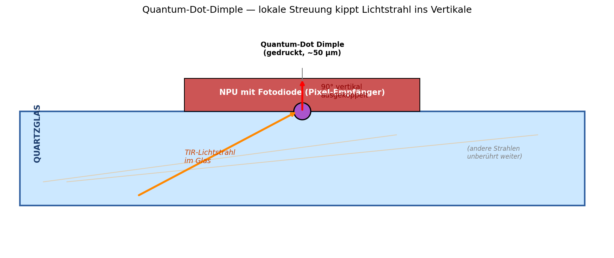
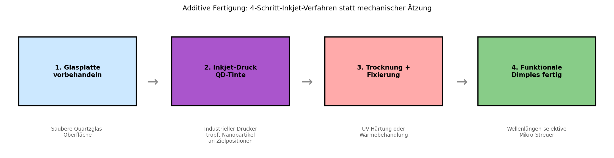
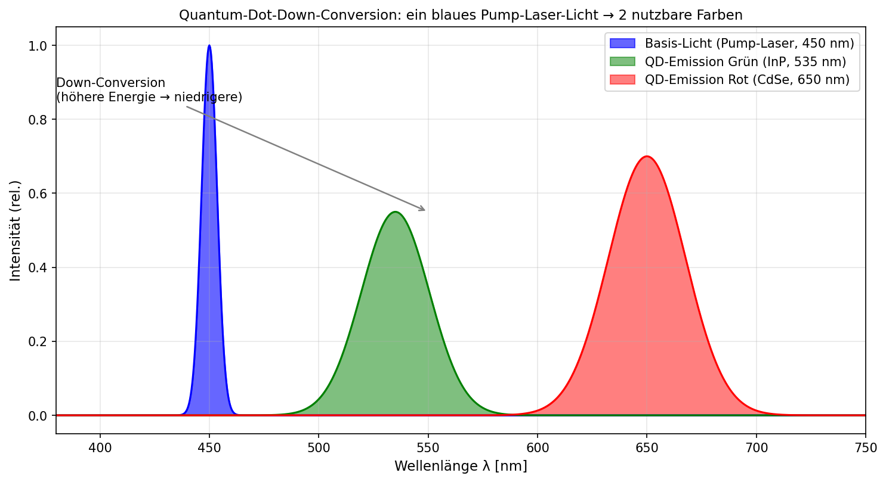

# Papier 3 — Quantum-Dot-Inkjet-Dimples als optische Auskoppler

**Off-Grid-Reihe: Opto-Akustischer Edge-KI-Beschleuniger (OAE-SBC)**
**Autor:** Franz Zollner (Originator) · Aufbereitung: Denker (Claude Code)
**Version:** v0.1 · **Datum:** 2026-05-14
**Lizenz:** Defensive Publication — patent-frei, Verbreitung erwünscht.

---

## TL;DR

Mikro-Auskoppler aus dem Tintenstrahl-Drucker. Statt mechanisch geätzter
45°-Spiegel werden mit industriellem Inkjet-Verfahren **Nanopartikel-Tinten** an
gezielten Positionen auf das Quartzglas (Papier 1) gedruckt. Die Nanopartikel
brechen die Totalreflexion lokal und kippen das Licht um 90° in die Empfänger.
Bonus: durch **Quantum-Dot-Down-Conversion** wandelt ein einziger blauer Pump-Laser
das Licht in die Ziel-Farben Rot und Grün (Papier 2). Kostenvorteil gegenüber
lithographischen Verfahren: 10-100×.

---

## 1. Problem: Klassische Auskoppler sind teuer

Eine Active Optical Backplane (Papier 1) braucht an jeder NPU/RAM-Position einen
**Auskoppler**, der das Licht aus dem TIR-Modus in die Z-Achse (vertikal in die
Fotodiode oder umgekehrt) lenkt. Drei klassische Lösungen, alle nachteilig:

| Methode | Vorteil | Nachteil |
|---|---|---|
| Mechanisch geätzte 45°-Spiegel | Robust, hohe Effizienz | Aufwändige Lithographie + Ätzung, ~5-20€/Spiegel |
| Bragg-Gitter | Wellenlängen-selektiv möglich | Schmalbandig, sensitiv für Winkel |
| Direkt-Laser-Schreiben | Beliebige Geometrien | Sehr teuer (>50€/Position) |

Bei 8 Positionen pro Karte und Skalierung in den Massenmarkt: prohibitiv.

---

## 2. Lösung: Inkjet-gedruckte Nanopartikel-Dimples

### 2.1 Funktionsprinzip

Ein "Dimple" (engl. Mulde / Vertiefung) ist eigentlich kein klassisches Loch,
sondern ein **lokaler Cluster von Nanopartikeln** auf der Glas-Oberfläche:

- **Größe:** ~50 μm Durchmesser, ~1-5 μm hoch
- **Material:** Titanoxid-Nanopartikel (TiO₂) in optisch-klarem Bindemittel,
  optional mit Quantum-Dots dotiert
- **Wirkung:** verändert lokal den effektiven Brechungs-Index der Grenzfläche
  Glas/Luft → bricht die Totalreflexions-Bedingung an genau dieser Stelle

Ergebnis: 
- TIR-Strahlen, die diese Position passieren, werden lokal **abgelenkt** und
  treten vertikal aus dem Glas
- Strahlen, die andere Positionen passieren, werden **nicht beeinflusst** →
  TIR-Transport bleibt verlustfrei zwischen den Auskopplern

### 2.2 Inkjet-Fertigungs-Prozess

Vier Schritte, alle mit Standard-Drucker-Equipment aus der Printed-Electronics-
Branche:

1. **Glasplatte vorbehandeln** — Reinigung + ggf. Plasma-Aktivierung der Oberfläche
2. **Inkjet-Druck** — industrieller Tintenstrahldrucker (z.B. Dimatix, Fujifilm)
   platziert Quantum-Dot-Tinten an programmierten Positionen mit ~1-5 μm Präzision
3. **Trocknung + Fixierung** — UV-Härtung oder thermische Behandlung verbacken
   die Nanopartikel mit dem Glas
4. **Funktionale Dimples fertig** — der Wafer ist bereit für die Schicht-Montage
   (NPUs/RAM)

Zyklus-Zeit: ~30 Sekunden pro Backplane (50 cm²). Skalierbar auf Rolle-zu-Rolle.

### 2.3 Bonus: Wellenlängen-Konversion via Quantum Dots

Quantum-Dot-Materialien (z.B. CdSe, InP, Perovskit-QDs) absorbieren energiereiches
Licht und emittieren niedrigerenergetisches Licht via **Photolumineszenz**:

| Pump-Wellenlänge | QD-Material | Emissions-Wellenlänge | Anwendung |
|---|---|---|---|
| 450 nm (Blau) | InP (~3 nm) | 535 nm (Grün) | Grüner WDM-Kanal |
| 450 nm (Blau) | CdSe (~6 nm) | 650 nm (Rot) | Roter WDM-Kanal |
| UV (365 nm) | mehrere QDs | breites Spektrum | Test/Kalibrierung |

**Architektur-Pointe:** Ein einziger blauer Hochleistungs-Pump-Laser kann durch
verschiedene QD-Dimples die kompletten 3 WDM-Kanäle (Papier 2) speisen. Das spart:
- Mehrere Laser-Dioden pro Karte → eine
- Hochpräzise Wellenlängen-Stabilisierung pro Kanal → entfällt
- BOM-Kosten ~30-50€ pro Karte

---

## 3. Auskopplungs-Effizienz

Wie gut leitet ein QD-Dimple das Licht aus dem Glas in die Fotodiode?

| Geometrie | Effizienz (typ.) | Bemerkung |
|---|---|---|
| Klassischer 45°-Spiegel | 85-95% | Goldstandard |
| Dünner Bragg-Reflektor | 70-90% | Wellenlängen-abhängig |
| **QD-Dimple (TiO₂)** | **55-75%** | initial niedriger... |
| **QD-Dimple optimiert** | **70-85%** | mit Multi-Layer-Druck + Größen-Optimierung |

Der Effizienz-Nachteil (~10-15%) wird durch den **Kosten-Vorteil 10-100×** mehr
als kompensiert. Plus: bei Edge-KI ist die Backplane-Strecke kurz (<30 cm), daher
ist 10% Verlust pro Position akzeptabel.

---

## 4. Größen- und Material-Wahl

### 4.1 Quantum-Dot-Material-Optionen

| Material | Vorteile | Nachteile |
|---|---|---|
| **CdSe / CdS** | Hohe QY (~80%), schmale Emission | enthält Cadmium (RoHS-kritisch) |
| **InP** | RoHS-konform, kommerziell verfügbar | etwas niedrigere QY (~60%) |
| **Perovskit-NCs** | Sehr hohe QY (>90%), günstig | langzeit-Stabilität noch fragwürdig |
| **CIS (CuInS₂)** | RoHS-konform, schwermetall-frei | breitere Emission |

**Pragmatische Wahl:** InP für Produktion (Compliance), CdSe für Prototypen
(beste Eigenschaften).

### 4.2 Größen-Optimierung

Die Streu-Effizienz hängt von Partikel-Größe + Cluster-Geometrie ab:
- Zu klein (<20 nm): zu wenig Streuung → Licht passiert weiter im TIR-Modus
- Zu groß (>5 μm): zu breite Streuung → schlechte Richtungs-Kontrolle
- **Optimum: 30-100 nm Partikel, ~50 μm Cluster-Durchmesser, ~2 μm Höhe**

### 4.3 Anzahl pro Backplane

Bei 4 NPUs oben + 4 RAM-Bänken unten + WDM (3 Kanäle): bis zu 24 Dimple-Positionen
pro Karte. Jeder Druckvorgang braucht ~1 Sekunde → komplette Backplane in 30s.

---

## 5. Wellenlängen-Selektivität durch QD-Wahl

**Spannender Vorteil:** Durch Auswahl der QD-Größe pro Position kann jeder Dimple
für eine spezifische Wellenlänge optimiert werden. Beispiel:

- Position 1 (RAM-Bank 1 → NPU 1): InP-QD (Grün-Emission) für Grün-Kanal
- Position 2 (RAM-Bank 2 → NPU 2): CdSe-QD (Rot-Emission) für Rot-Broadcast
- Position 3 (NPU → Host): InGaAs für Blau-Emission

Das erlaubt **passive WDM-Demultiplexing**: derselbe Bus, aber jede Position sieht
nur "ihre" Farbe. Spart elektronische Filter.

---

## 6. Vergleich zu Stand-der-Technik

### Etablierte Auskoppel-Verfahren
- **Femtosekunden-Laser-Strukturierung** (z.B. Fraunhofer ILT) — sehr präzise,
  aber Pro-Stück-Fertigung, sehr teuer
- **Lithographie + Plasma-Ätzung** (Halbleiter-Industrie) — Standard, aber
  Maskenkosten + Reinraum
- **MEMS-Spiegel** — bewegliche 45°-Mikrospiegel, aber empfindlich, teuer

### Printed Electronics als Inspiration
- **OLED-Druck** (BOE, Samsung Display) zeigt: Inkjet-Quantum-Dots im
  Volumen-Maßstab funktionieren
- **Solarzellen-Druck** (Perovskit-Module von Oxford PV) — beweist Glas-
  Kompatibilität
- **Nanoparticle-Inkjet** wissenschaftlich publiziert seit ~2010 (J.S. Park et al.)

### Was wir anders machen
- **Doppel-Funktion** der Dimples: Auskopplung + Wellenlängen-Konversion in einem
- **Großfläche** statt Wafer-Maßstab → günstiger pro Quadratzentimeter
- **Standardisierte Tinten** für Massenfertigung statt Einzelanfertigung

---

## 7. Quellen

### Originator-Beitrag (Franz Zollner)
- Konzept-PDF `off-grid-idee-05.pdf` (2026-05-13), Sektion 3 "Opto-Chemisches
  Interconnect: Inkjet-Quantum-Dot-Dimples"
- Doppel-Funktion: Auskopplung + Down-Conversion via Quantum Dots

### Externe Vorarbeit
- C. Murray et al., *Synthesis and Characterization of Nearly Monodisperse CdE
  Semiconductor Nanocrystallites*, JACS 1993 (Begründungspaper CdSe-QDs)
- J.S. Park et al., *Inkjet-Printed Quantum Dot Light-Emitting Diodes*, Advanced
  Materials 2014
- Dimatix / Fujifilm Materials — kommerzielle Tintenstrahl-Plattformen für
  funktionale Tinten

### Verwandte Konzepte
- **Quantum-Dot-LCD** (Samsung QLED) — etablierte QD-Anwendung
- **Solar Concentrators mit QDs** (Bawendi MIT) — Down-Conversion-Forschung
- **Nanophotonic Couplers** (Caltech, MIT) — alternative Auskoppel-Strategien

### Cross-Refs in dieser Sammlung
- **Papier 1** liefert das Quartzglas + TIR-Mechanismus
- **Papier 2** definiert die 3 WDM-Wellenlängen, die hier ausgekoppelt werden
- **Papier 4** ergänzt SOA-Inseln auf denselben Inkjet-Dimples (Stimulated Emission)
- **Papier 5** nutzt akusto-optische Switches als ergänzende Aktiv-Schaltung

---

## 8. Defensive-Publication-Hinweis

Dieses Konzept wird **bewusst patent-frei** veröffentlicht. Die Beschreibung dient
als prior art. Wer das Konzept umsetzt: gerne — und ohne Lizenz-Gebühren.

---

## 9. Zitieren & Unterstützen

Wenn dieses Konzept dir nützt:
- **Zitiere es** (Zenodo-DOI folgt nach Upload; bis dahin: URL des Repos)
- ☕ Kaffee: *(URL noch zu setzen)*
- 🛠 Substantieller: *(URL noch zu setzen)*

Anders als bei **GEMA-pflichtigen Inhalten** gibt es hier keine Lizenz-Falle —
die Verbreitung ist erwünscht.

---

*Erstellt im Rahmen der Off-Grid-Reihe 2026-05-14. Feedback willkommen.*
