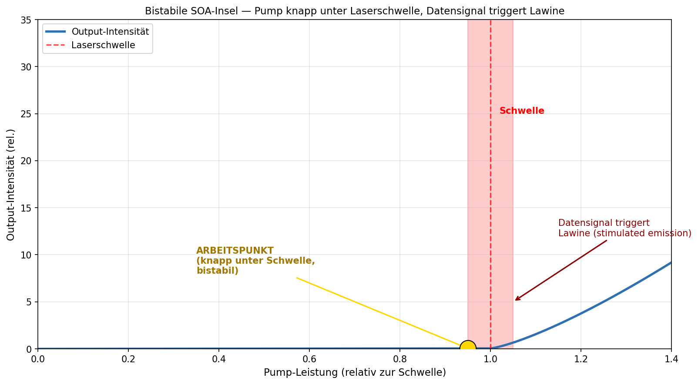
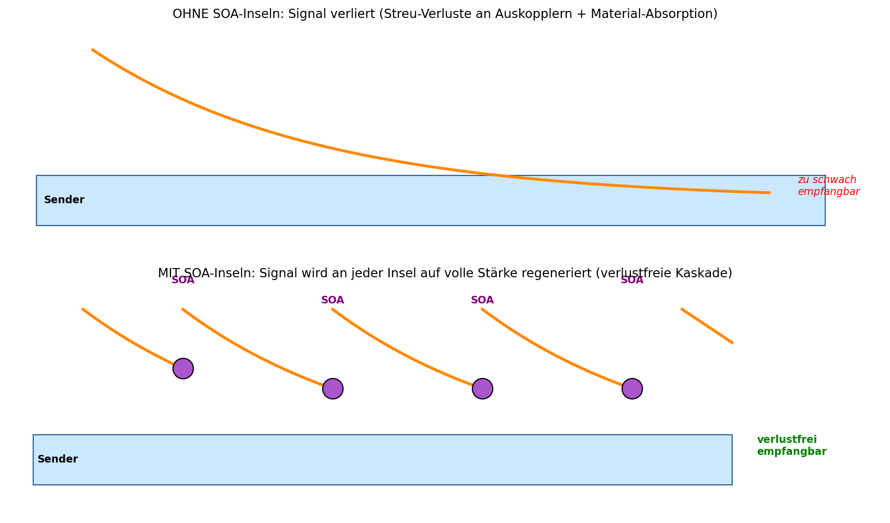
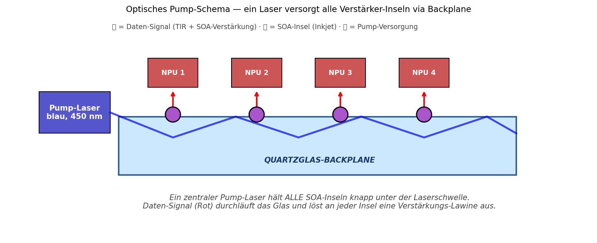

# Papier 4 — Optisch gepumpte SOA-Inseln zur Signal-Regeneration

**Off-Grid-Reihe: Opto-Akustischer Edge-KI-Beschleuniger (OAE-SBC)**
**Autor:** Franz Zollner (Originator) · Aufbereitung: Denker (Claude Code)
**Version:** v0.1 · **Datum:** 2026-05-14
**Lizenz:** Defensive Publication — patent-frei, Verbreitung erwünscht.

---

## TL;DR

Mikroskopische Halbleiter-Optical-Amplifier (SOA-Inseln) auf den Inkjet-Dimples
(Papier 3) werden durch einen zentralen Pump-Laser **knapp unterhalb der
Laserschwelle** gehalten. Ein eintreffendes Daten-Signal (Photon aus dem
WDM-Broadcast, Papier 2) triggert per **stimulated emission** eine
Verstärker-Lawine. Ergebnis: jede SOA-Insel **regeneriert das Signal auf volle
Stärke** — verlustfreie Kaskade über die ganze Backplane, **ohne lokale
Strom-Versorgung** zu den Verstärker-Punkten.

---

## 1. Problem: Verluste in einer kaskadierten Backplane

Auch mit Quartzglas-TIR (Papier 1, <0.001 dB/cm) summieren sich Verluste:
- **Auskoppler-Verluste** an jedem Quantum-Dot-Dimple (Papier 3): 15-30%
- **Material-Absorption** bei Wellenlängen abseits des Optimums: 0.5-2 dB/Strecke
- **WDM-Cross-Talk** zwischen den 3 Farbkanälen (Papier 2)
- **Streuverluste** an Mikro-Inhomogenitäten im Glas

Bei langen Backplanes (>30 cm) oder vielen Auskoppel-Stationen ist die
Signal-Stärke am Ende der Kette zu schwach — die Empfänger-Fotodioden brauchen
mindestens ~0.1 mW Lichtintensität für saubere Detektion.

**Klassische Lösung:** elektrisch versorgte Verstärker an jeder Position. Aber das
bedeutet: Kupferleitungen zu den Verstärkern, lokale Strom-Versorgung, Wärme-
Entwicklung an unerwünschten Stellen — alles was wir mit der optischen
Backplane gerade VERMEIDEN wollten.

---

## 2. Lösung: Optisch gepumpte Verstärker-Inseln

### 2.1 Funktions-Prinzip — Bistabile SOA



Ein **Semiconductor Optical Amplifier (SOA)** ist ein Halbleiter-Material (z.B.
Galliumnitrid GaN, Indium-Galliumarsenid InGaAs), das mit Pump-Energie zu einer
Photonen-Lawine ausgelöst werden kann. Die Kennlinie hat eine **scharfe
Schwelle**:

- Unterhalb der Schwelle: nur spontane Emission (schwach, ungerichtet)
- An der Schwelle: bistabile Region — kleine zusätzliche Anregung kann
  Lawine auslösen
- Oberhalb der Schwelle: stimulated emission, kohärenter Verstärker-Output

**Architektur-Pointe:** Der Pump-Laser hält die SOA-Inseln im **bistabilen
Arbeitspunkt** knapp unter der Schwelle. Ein eintreffendes Daten-Photon liefert
genau die zusätzliche Energie, die nötig ist, um die Lawine zu zünden — das
gesendete Photon wird **mit einer Lawine identischer Photonen verstärkt**
ausgesandt.

Das ist effektiv ein **photonischer Transistor** mit hoher Verstärkung und
sehr niedrigem Eigen-Rauschen.

### 2.2 Verlustfreie Kaskade



**Oben (ohne SOA):** Signal-Verlust akkumuliert über die Strecke, Empfänger sehen
zu wenig Licht.

**Unten (mit SOA-Inseln):** an jeder Insel wird das Signal auf volle Stärke
regeneriert. Die Strecke ist faktisch unbegrenzt — Verluste werden lokal kompensiert.

### 2.3 Pump-Versorgung — zentraler Laser



**Ein einziger** blauer Pump-Laser (450 nm, 100-500 mW) speist alle SOA-Inseln auf
der Backplane. Das Pump-Licht propagiert via **dem selben TIR-Modus** wie die
Daten-Signale, nur in einer dafür reservierten Wellenlänge oder Richtung.

**Was das System besonders macht:**
- Keine Kupferleitungen zu den Verstärkern
- Keine lokale Strom-Versorgung
- Keine Wärme an unerwünschten Stellen
- Die SOA-Inseln können beliebig dicht oder beliebig weit verteilt sein
- Pump-Laser sitzt am Rand der Karte (kühlbar, austauschbar)

---

## 3. Material-Wahl für SOA-Inseln

| Material | Pump-λ | Verstärkungs-λ | Schwelle | Bemerkung |
|---|---|---|---|---|
| **GaN** | 405 nm | 450 nm (Blau) | ~10 µJ/cm² | UV-Pump, robust |
| **InGaN-QW** | 450 nm | 530 nm (Grün) | ~5 µJ/cm² | Etabliert (LEDs/Laser) |
| **InGaAsP** | 980 nm | 1310-1550 nm | ~3 µJ/cm² | Telecom-Standard |
| **Organische SOA** | 450 nm | 600-650 nm | ~50 µJ/cm² | sehr günstig, niedrige Lebensdauer |

**Pragmatische Wahl für OAE-SBC:** InGaN-Quantenfilme — Standard-Technologie aus
LED-Industrie, Pump-Wellenlänge passt zu unserem Blau-Pump-Schema (Papier 3),
Verstärkungs-Bereich passt zu Grün-Kanal (Papier 2).

---

## 4. Inkjet-Integration mit Quantum-Dots

Die SOA-Inseln sitzen genau auf denselben Inkjet-Positionen wie die
Quantum-Dot-Dimples (Papier 3):

```
Pixel-Bauplan (z.B. an einer NPU-Empfangs-Position):

  ┌────────────────────────────────┐
  │  obere Schicht: NPU            │  ← Empfänger
  ├────────────────────────────────┤
  │  Mikro-Verkapselung (Glas)     │
  ├────────────────────────────────┤
  │  ▒ SOA-Insel (GaN/InGaN, ~5µm)│  ← Verstärker
  ├────────────────────────────────┤
  │  ◉ Quantum-Dot-Dimple (TiO₂)  │  ← Auskoppler
  ├────────────────────────────────┤
  │  Quartzglas-Wellenleiter        │  ← Lichtbus
  └────────────────────────────────┘
```

Beide Strukturen werden im selben Inkjet-Prozess gedruckt — nur mit
unterschiedlichen Tinten. Das spart einen Fertigungs-Schritt und ermöglicht
**perfekte Ausrichtung** der beiden Schichten.

---

## 5. Skalierungs-Effekte

### 5.1 Wie viele Inseln pro Backplane?

Je nach Backplane-Größe und Verlust-Profil:
- **Klein (10 cm):** 4-8 Inseln reichen
- **Mittel (30 cm):** 8-16 Inseln, alle 2-4 cm
- **Groß (60 cm):** 20-30 Inseln, dichteres Raster

Da SOA-Inseln nicht extra verkabelt werden müssen, gibt es **keinen** lokalen
Bandbreiten-/Stromverbrauchs-Nachteil bei dichterer Bestückung.

### 5.2 Wieviel Pump-Leistung?

Faustregel: pro SOA-Insel ~5-20 mW Pump-Leistung (für GaN/InGaN). Bei 16 Inseln
also 80-320 mW Pump-Gesamt — entspricht einer kommerziellen Laser-Diode.

### 5.3 Kann eine Insel ausfallen?

Ja, und das ist **graceful degradation:** wenn eine SOA-Insel ausfällt,
funktioniert die Kette mit einem Signal-Sprung weiter — nur die unmittelbar
folgenden Auskoppler sehen schwächeres Signal. Bei guter Insel-Dichte ist das
trotzdem über der Detektions-Schwelle.

---

## 6. Vergleich zu Stand-der-Technik

### Klassische optische Verstärker
- **EDFA (Erbium-Doped Fiber Amplifier):** Telecom-Standard, aber nur für
  1530-1560 nm, externes Pumpmodul, nicht in Backplane integrierbar
- **Raman-Verstärker:** sehr effizient, aber komplexe Pumpgeometrie, große
  Distanzen nötig
- **Diskrete SOA-Chips (z.B. Thorlabs):** etablierte Bauteile, aber elektrisch
  gepumpt, ~1 cm² pro Stück, ~500€/Stück

### Optisches Pumpen
- **VECSEL** (Vertical-External-Cavity Surface-Emitting Laser): hochgepumpte
  Halbleiter-Laser, ähnliches Prinzip, aber als diskreter Resonator
- **Optical Pumping in Faserlasern:** Mature Technology, aber für 1D-Fasern,
  nicht 2D-Backplanes
- **MEMS-Photonik mit optischem Pumpen** (akademisch): Forschungs-Stand, viel
  Potenzial

### Was wir anders machen
- **2D-Backplane-Integration** statt 1D-Faser
- **Inkjet-Fertigung** statt Lithographie → 10-100× billiger
- **Co-Lokation mit Auskopplern** (Papier 3) → keine extra Positions-Justage
- **Pump-Sharing** mit dem WDM-System (Papier 2) — derselbe Blau-Pump versorgt
  Down-Conversion UND SOA-Inseln

---

## 7. Quellen

### Originator-Beitrag (Franz Zollner)
- Konzept-PDF `off-grid-idee-05.pdf` (2026-05-13), Sektion 5
  "Signal-Regeneration: Optisch gepumpte Halbleiter-Verstärker (SOA)"
- Idee der bistabilen Insel-Topologie ohne lokale Strom-Versorgung

### Externe Vorarbeit
- M.J. Connelly, *Semiconductor Optical Amplifiers* (Springer, 2002) —
  Standard-Lehrbuch
- S. Nakamura et al., *Optical Pumping of GaN-Based Lasers*, Applied Physics
  Letters (mehrere Papers 2000-2010)
- C. Heisler et al., *Optically Pumped Semiconductor Amplifiers for Integrated
  Photonics*, Optics Express 2018

### Verwandte Konzepte
- **VECSEL** (Vertical-External-Cavity Surface-Emitting Laser) — ähnliches
  optisches Pumpen
- **Photonische Transistoren** (akademisch, viele Varianten) — ähnliche
  Idee der bistabilen Photonen-Steuerung
- **Plasmonics-Verstärker** (sub-Wellenlängen-Strukturen) — Alternative für
  noch kleinere Inseln

### Cross-Refs in dieser Sammlung
- **Papier 1** liefert das Quartzglas + TIR-Bus
- **Papier 2** definiert die WDM-Kanäle, die hier verstärkt werden
- **Papier 3** beschreibt die Inkjet-Quantum-Dot-Dimples, auf denen die
  SOA-Inseln sitzen
- **Papier 5** ergänzt akusto-optische Switches zur dynamischen
  Verstärkungs-Modulation
- **Papier 6** integriert das Pump-Schema in das Gesamt-System

---

## 8. Defensive-Publication-Hinweis

Dieses Konzept wird **bewusst patent-frei** veröffentlicht. Die Beschreibung dient
als prior art. Wer das Konzept umsetzt: gerne — und ohne Lizenz-Gebühren.

---

## 9. Zitieren & Unterstützen

Wenn dieses Konzept dir nützt:
- **Zitiere es** (Zenodo-DOI folgt nach Upload; bis dahin: URL des Repos)
- ☕ Kaffee: *(URL noch zu setzen)*
- 🛠 Substantieller: *(URL noch zu setzen)*

Anders als bei **GEMA-pflichtigen Inhalten** gibt es hier keine Lizenz-Falle —
die Verbreitung ist erwünscht.

---

*Erstellt im Rahmen der Off-Grid-Reihe 2026-05-14. Feedback willkommen.*
