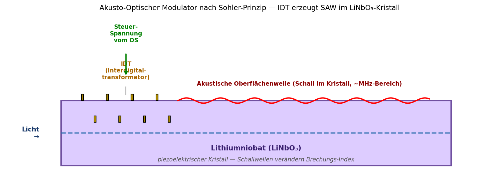
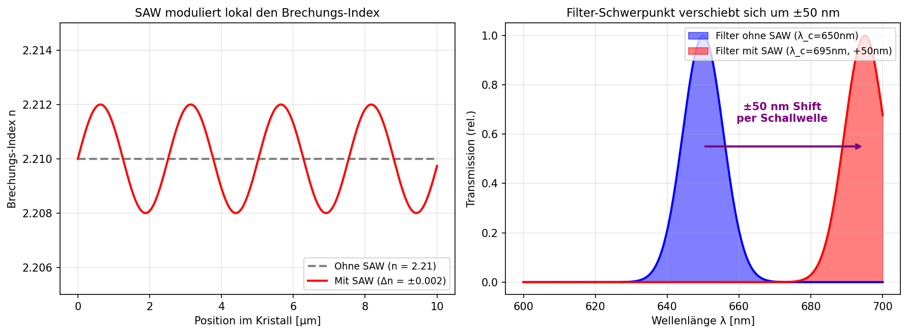
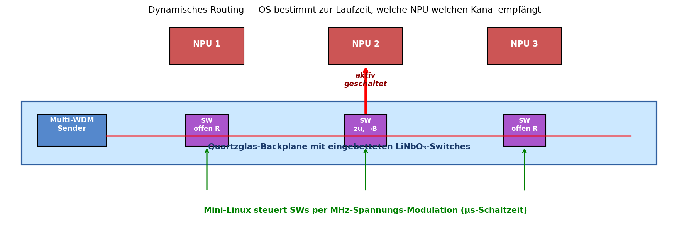

# Papier 5 — Akusto-optische Switches (Sohler-Prinzip)

**Off-Grid-Reihe: Opto-Akustischer Edge-KI-Beschleuniger (OAE-SBC)**
**Autor:** Franz Zollner (Originator) · Aufbereitung: Denker (Claude Code)
**Methoden-Würdigung:** Prof. em. Dr. Wolfgang Sohler, Universität Paderborn
**Version:** v0.1 · **Datum:** 2026-05-14
**Lizenz:** Defensive Publication — patent-frei, Verbreitung erwünscht.

---

## TL;DR

Eine kleine Insel aus **Lithiumniobat (LiNbO₃)** auf der Quartzglas-Backplane,
gesteuert von **Surface Acoustic Waves (SAW)**, dient als dynamisch
umschaltbarer Wellenlängen-Filter. Mit niedrig-frequenter Schallwelle
(MHz-Bereich) verschiebt sich der Filter-Schwerpunkt um **±50 nm** — schnell
genug für Mikrosekunden-Switching. Das gibt dem System die Fähigkeit zum
**laufenden Routing**: das OS entscheidet zur Laufzeit, welcher NPU welchen
WDM-Kanal sieht.

---

## 1. Problem: Statisches Routing reicht nicht

Mit den bisherigen Papieren (1-4) haben wir eine optische Backplane mit
WDM-Broadcast und Signal-Regeneration. Aber: das Routing ist **statisch**.
Welche NPU empfängt welche Wellenlänge, hängt vom Auskoppler-Design (Papier 3)
ab. Das ist zur Karten-Fertigungszeit festgelegt.

Bei flexiblen KI-Workloads brauchen wir **dynamisches Routing**:
- Eine NPU soll mal Modellgewichte (Rot), mal Sensor-Eingaben (Grün) bekommen
- Ein Modell soll von einer NPU zur nächsten "wandern" (Pipeline-Stages)
- Kanäle sollen on-the-fly umgeschaltet werden, ohne Hardware-Änderung

→ Wir brauchen einen **schnellen, elektronisch steuerbaren Filter**.

---

## 2. Lösung: Akusto-optische Modulation in Lithiumniobat

### 2.1 Würdigung der wissenschaftlichen Grundlage

Die folgende Architektur baut direkt auf den jahrzehntelangen Forschungen von
**Prof. em. Dr. Wolfgang Sohler** (Angewandte Physik / Optik, Universität
Paderborn) zur **integrierten Optik in Lithiumniobat** auf. Sohler hat ab
ca. 1985 systematisch gezeigt, wie aus LiNbO₃-Wafern via Ionen-Indiffusion und
photolithographischer Strukturierung **passive und aktive optische
Komponenten** auf einem einzigen Chip integriert werden können — inklusive
**akusto-optische Schalter** mit SAW-Steuerung.

Das hier vorgeschlagene Konzept überträgt das **Sohler-Prinzip** auf eine
**großflächige Glas-Backplane**: nicht ein-Wafer-Integration, sondern
Inkjet-gefertigte LiNbO₃-Inseln, die in der Quartzglas-Trägerplatte (Papier 1)
sitzen.

### 2.2 SAW-Erzeugung über Interdigital-Transformatoren

Auf der LiNbO₃-Insel werden zwei kammartige Metall-Elektroden gedruckt —
sogenannte **Interdigital-Transformatoren (IDTs)**. Wenn an die IDTs eine
hochfrequente Wechselspannung (MHz-Bereich) angelegt wird, regt der
piezoelektrische Effekt des Kristalls eine **Oberflächen-Schallwelle (Surface
Acoustic Wave, SAW)** an.

Die SAW propagiert mit ca. 3500 m/s entlang der Kristall-Oberfläche und
moduliert lokal das Kristall-Gitter, was wiederum den **Brechungsindex**
periodisch ändert.

### 2.3 Brechungsindex-Modulation → Wellenlängen-Shift

**Links:** Ohne SAW ist der Brechungsindex konstant (n ≈ 2.21 für LiNbO₃ bei
650 nm). Mit SAW oszilliert er um ±0.002.

**Rechts:** Die Insel wirkt als Wellenlängen-Filter mit Schwerpunkt λ_c, der
direkt vom Brechungsindex abhängt. Per SAW-Modulation **verschiebt** sich
λ_c um **±50 nm** — genug, um zwischen den WDM-Kanälen aus Papier 2 (Grün
530 nm, Rot 650 nm, Blau 450 nm) sauber umzuschalten.

### 2.4 Schalt-Geschwindigkeit

Die SAW-Phase ändert sich innerhalb weniger MHz-Perioden = **Mikrosekunden**.
Im Vergleich:
- Datenrate pro WDM-Kanal: ~100 Gbit/s (~10 ps pro Bit)
- Schaltzeit eines Frames: ~10 ns (1000 Bits)
- **AOTF-Schaltzeit: ~1 µs** = 100 Frames Latenz pro Switch

Das ist langsam genug, um nicht die Daten-Übertragung zu stören, aber schnell
genug für jegliche realistische KI-Routing-Operation (Modell-Wechsel,
Pipeline-Reconfiguration).

---

## 3. Dynamisches Routing in der OAE-SBC

**Anwendungs-Beispiel:**

Das Mini-Linux auf dem Steuer-SoC (Papier 6) hat die Möglichkeit, zu jedem
Zeitpunkt zu entscheiden:

- "NPU 1 bekommt jetzt Modellgewichte (Rot-Kanal)" → SW1 öffnet für Rot
- "NPU 2 bekommt jetzt Sensor-Eingaben (Grün-Kanal)" → SW2 verschiebt nach Grün
- "NPU 3 wartet (kein Stream)" → SW3 sperrt

**OS-Schnittstelle:** Jeder Switch ist als `/dev/aot0`, `/dev/aot1`, ... dem
Linux-Kernel als Device exponiert. Anwendungen können per `ioctl()` oder über
einen User-Space-Daemon die Wellenlängen-Position eines Switches steuern.

**Schaltzeit gesamt:** Befehl vom OS → IDT-Spannung anlegen → SAW-Aufbau →
Filter-Shift → stabile Übertragung: ~5-10 µs.

---

## 4. Konkrete Material-/Fertigungs-Hinweise

### 4.1 LiNbO₃-Inseln

- **Substrat:** Z-cut Lithiumniobat-Wafer (Standard 76 mm Wafer ~50€), zugeschnitten
  in ~5×5 mm Inseln
- **Bonding:** UV-härtender Optisch-Klar-Kleber auf Quartzglas
- **IDT-Druck:** Silber-Nanopartikel-Tinte mit Inkjet → 50-100 IDT-Finger,
  Linienbreite ~10 µm

### 4.2 Frequenz-Auslegung

Für ±50 nm Shift bei 650 nm Mitten-Wellenlänge:
- SAW-Wellenlänge: ~10 µm
- SAW-Frequenz: ~350 MHz (Schallgeschwindigkeit 3500 m/s / 10 µm)
- Treiberleistung: ~10-50 mW (gering, Standard-RF-Generator reicht)

### 4.3 Optimierung

- **Acceptance Bandwidth:** ~30 nm bei -3 dB. Reicht für saubere Kanal-Trennung.
- **Insertion Loss:** ~2-3 dB durch die LiNbO₃-Insel — kompensierbar durch
  benachbarte SOA-Insel (Papier 4)
- **Wavelength Range:** 400-1600 nm in LiNbO₃, deckt alle WDM-Kanäle ab

---

## 5. Erweiterte Funktionen

### 5.1 Mehrfach-Switch
Mehrere parallele IDTs auf derselben LiNbO₃-Insel können verschiedene SAW-Frequenzen
gleichzeitig erzeugen → **Polyphone Schaltung**: mehrere Wellenlängen gleichzeitig
geroutet.

### 5.2 Verzögerungslinie
Eine SAW braucht definierte Zeit für die Strecke. Genaue Geometrie-Wahl
ermöglicht **akustische Verzögerungs-Glieder** im µs-Bereich — nutzbar für
Synchronisation der WDM-Kanäle (Papier 2).

### 5.3 Akustische Tomographie
Mehrere SAW-Trains in verschiedenen Richtungen bilden ein **Akustik-Gitter**.
Damit ließen sich theoretisch 2D-Filter und sogar **akusto-optische Demultiplexer**
realisieren — eine ganze Klasse von Funktionen für zukünftige Erweiterungen.

---

## 6. Vergleich zu Stand-der-Technik

### Etablierte Switch-Technologien
- **MEMS-Spiegel-Switches**: 1-10 ms Schaltzeit, mechanische Abnutzung, teuer
- **Mach-Zehnder-Modulatoren (LiNbO₃)**: schneller (ps-ns) aber elektrisch
  gepumpt, hohe Leistung
- **Liquid-Crystal-on-Silicon**: Millisekunden, große Strukturen
- **Thermo-optische Switches**: ~ms, Wärme-Aufbau

### AOTF (Acousto-Optic Tunable Filter)
- **Standard-AOTF-Bauteil** (Brimrose, Gooch & Housego): diskrete Komponenten,
  ~500-2000€ pro Stück, Tisch-Größe
- **Sohler-Schule integrierte AOTFs in LiNbO₃**: kleiner, integriert,
  Forschungsprodukt — genau worauf dieses Konzept aufbaut

### Was wir anders machen
- **Inkjet-Druck** der LiNbO₃-Inseln statt Wafer-Skala-Lithographie
- **Hybride Glas-Backplane** statt vollständig LiNbO₃-Wafer (Kostenersparnis 10-50×)
- **Co-Lokation mit Quantum-Dot-Auskopplern** (Papier 3) und **SOA-Inseln** (Papier 4)
  auf derselben Insel-Geometrie

---

## 7. Quellen

### Originator-Beitrag (Franz Zollner)
- Konzept-PDF `off-grid-idee-05.pdf` (2026-05-13), Sektion 6
  "Dynamisches Routing: Akusto-optische Frequenzsteuerung (Sohler-Prinzip)"
- Idee der LiNbO₃-Inseln in der Glas-Backplane mit SAW-Schaltung

### Externe Vorarbeit
- **W. Sohler** (Univ. Paderborn) — *Integrated Optics in LiNbO₃*,
  zahlreiche Publikationen ab 1985 in Optical Engineering und Journal of
  Lightwave Technology. Begründer der integrierten LiNbO₃-Photonik.
- A. Yariv, P. Yeh, *Optical Waves in Crystals* (Wiley, 1984) — Grundlagen
  Akusto-Optik
- E. Wooten et al., *A Review of Lithium Niobate Modulators*, IEEE Journal of
  Selected Topics in Quantum Electronics, 2000

### Verwandte Konzepte
- **Standard-AOTF** in Spektroskopie und Mikroskopie — gleiches Prinzip,
  größere Bauform
- **SAW-Filter** in Mobilfunk (GHz-Bereich, RF-Filterung) — selbe Physik,
  anderes Anwendungsfeld
- **Integrierte Photonik auf Thin-Film LiNbO₃** (HARV, MIT, ETHZ) — neueste
  Forschung mit ps-Schaltzeiten

### Cross-Refs in dieser Sammlung
- **Papier 1** liefert das Quartzglas-Substrat
- **Papier 2** definiert die WDM-Kanäle, zwischen denen hier geschaltet wird
- **Papier 3** beschreibt die Inkjet-Quantum-Dot-Dimples (gleiche Druck-Plattform)
- **Papier 4** ergänzt SOA-Inseln zur Verlust-Kompensation
- **Papier 6** integriert das OS-Steuer-Interface (`/dev/aot0` etc.)

---

## 8. Defensive-Publication-Hinweis

Dieses Konzept wird **bewusst patent-frei** veröffentlicht. Die Beschreibung dient
als prior art. Wer das Konzept umsetzt: gerne — und ohne Lizenz-Gebühren.

**Hinweis zur akademischen Nutzung:** Bei Verwendung des Konzepts in Forschung
oder Lehre wäre eine **Würdigung der wissenschaftlichen Schule von Prof. Sohler**
(Univ. Paderborn) angemessen, da dessen Vorarbeit die Grundlage bildet.

---

## 9. Zitieren & Unterstützen

Wenn dieses Konzept dir nützt:
- **Zitiere es** (Zenodo-DOI folgt nach Upload; bis dahin: URL des Repos)
- ☕ Kaffee: *(URL noch zu setzen)*
- 🛠 Substantieller: *(URL noch zu setzen)*

Anders als bei **GEMA-pflichtigen Inhalten** gibt es hier keine Lizenz-Falle —
die Verbreitung ist erwünscht.

---

*Erstellt im Rahmen der Off-Grid-Reihe 2026-05-14. Feedback willkommen.*
