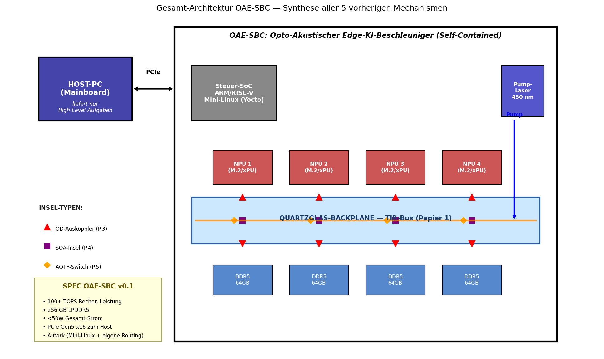
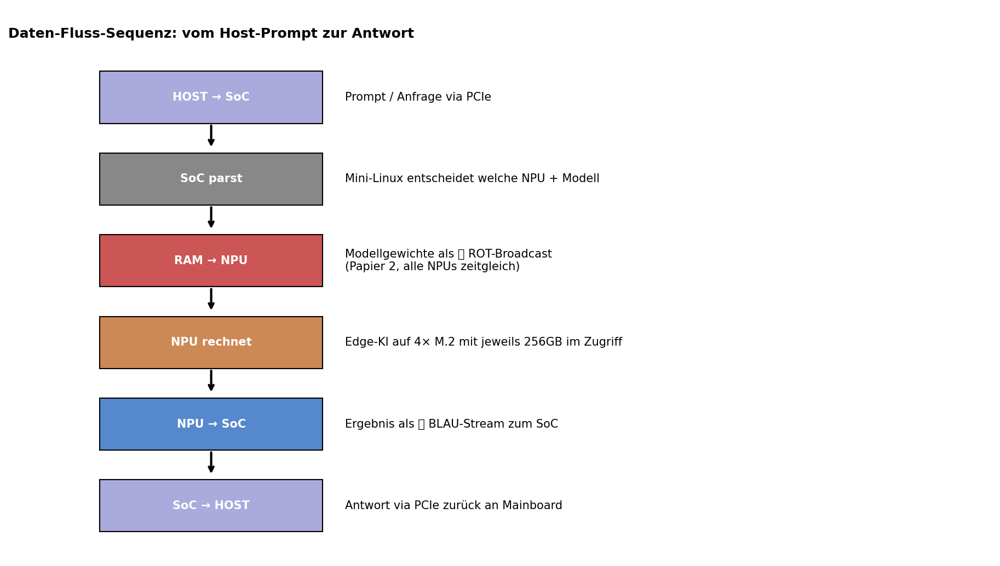
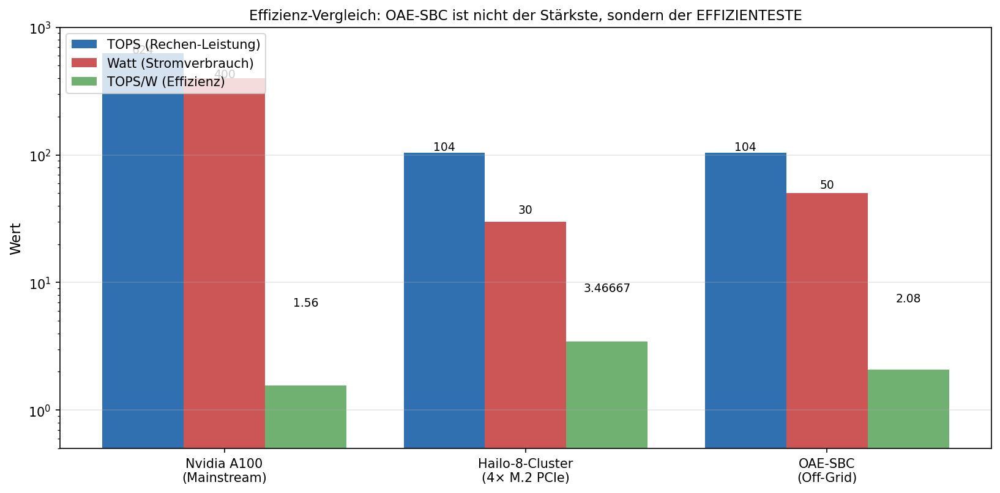

# Papier 6 — Self-Contained-Accelerator-Topologie (Synthese)

**Off-Grid-Reihe: Opto-Akustischer Edge-KI-Beschleuniger (OAE-SBC)**
**Autor:** Franz Zollner (Originator) · Aufbereitung: Denker (Claude Code)
**Version:** v0.1 · **Datum:** 2026-05-14
**Lizenz:** Defensive Publication — patent-frei, Verbreitung erwünscht.

---

## TL;DR

Synthese-Papier — die fünf vorhergehenden Mechanismen (Quartzglas-TIR + WDM-Broadcast
+ Quantum-Dot-Dimples + SOA-Inseln + AOTF-Switches) ergeben zusammen einen
**autarken Beschleuniger-Knoten**: eine PCIe-Steckkarte mit eigenem Mini-Linux,
die intern alle Daten-Pfade optisch löst und nur **High-Level-Aufgaben** vom Host
empfängt. Das ist nicht der schnellste KI-Chip, aber der **effizienteste**: bei
~100 TOPS unter 50W liegt die Effizienz bei ~2 TOPS/W — vergleichbar zu modernen
Embedded-AI-Lösungen, aber **ohne Vendor-Lock-in** und vollständig open-source.

---

## 1. Die "Off-Grid"-Pointe

Klassische KI-Beschleuniger sind **abhängig**:
- Vom Host-Mainboard (Routing der Daten via PCIe)
- Vom Vendor-Treiber (proprietäre Firmware)
- Vom Strom-Netz (300-700W typisch bei Datacenter-GPUs)
- Vom Cloud-Provider (Wartung, Updates, Lizenzen)

Die OAE-SBC ist **off-grid**:
- Eigene Routing-Entscheidungen via Mini-Linux auf dem Steuer-SoC
- Open-Source-Firmware (Yocto-Linux + offene Treiber)
- <50W Gesamtverbrauch (kann via Solar-eFuel betrieben werden — Papier 7)
- Keine Cloud-Abhängigkeit, KI-Inferenz lokal

→ Konsequenz: **Inferenz-as-a-Service ohne Service-Provider**.

---

## 2. Gesamt-Architektur



Die OAE-SBC-Karte hat sieben Bereiche:

### 2.1 Host-Schnittstelle (links)
PCIe Gen5 x16 zum Host-Mainboard. **NICHT** für Datenmassen, sondern nur für
**High-Level-Befehle** ("rechne dieses Modell auf Eingabe X"). Bandbreite hier
nicht kritisch (~10 GB/s reicht), da die Mass-Data (Modellgewichte) **NIE über
PCIe gehen** — sie liegen im lokalen DDR5 und fließen über die optische Backplane.

### 2.2 Steuer-SoC (ARM/RISC-V mit Mini-Linux)
Mini-Linux (Yocto- oder Ubuntu-Core-Variante) verwaltet:
- PCIe-Treiber zum Host
- WDM-Channel-Routing (Papier 2)
- AOTF-Switches (Papier 5) für dynamisches Routing
- SOA-Pump-Steuerung (Papier 4) — Laser-Leistung adaptive
- Modell-Verteilung im DDR5

### 2.3 Pump-Laser (rechts)
Ein einziger 100-500 mW blauer Pump-Laser (450 nm) versorgt:
- Quantum-Dot-Down-Conversion (Papier 3) → erzeugt Grün und Rot
- SOA-Inseln (Papier 4) → hält Verstärker auf Schwelle

### 2.4 4× NPU (Top-Row, M.2)
Standard-NPU-Module (z.B. Hailo-äquivalent, Coral, oder xPU-spezifisch). Jeder
liefert ~25-30 TOPS. Über die optische Backplane bekommen sie:
- Modellgewichte (Rot-Broadcast)
- Eingaben (Grün-Stream)
- Sync-Signale (Blau-Pulse)

### 2.5 Quartzglas-Backplane (Mitte)
Der zentrale Daten-Bus. Trägt alle drei WDM-Kanäle simultan, mit Auskopplungen
an den Quantum-Dot-Dimples (Papier 3).

### 2.6 4× DDR5 SO-DIMM (Bottom-Row)
4× 64 GB = 256 GB lokaler Speicher für Modellgewichte. Auch optisch angebunden
(Papier 1, zweiseitige Bestückung). Steckbar für Service.

### 2.7 Funktions-Inseln (markiert)
Auf jeder Auskoppel-Position sitzen drei Schichten:
- 🔺 Quantum-Dot-Dimple (Auskoppler, Papier 3)
- 🟪 SOA-Insel (Verstärker, Papier 4)
- 🔶 AOTF-Switch (Wellenlängen-Schalter, Papier 5)

Alle gedruckt via Inkjet auf demselben Substrat.

---

## 3. Daten-Fluss am Beispiel einer Inferenz



Vom Host-Prompt zur Antwort in 6 Schritten:

1. **HOST → SoC (via PCIe)** — Host schickt "rechne Modell M auf Eingabe X"
2. **SoC parst** — Mini-Linux wählt freie NPU(s), lädt Modell M aus DDR5
3. **RAM → NPU (Rot-Broadcast)** — Modellgewichte via optische Backplane
   gleichzeitig an alle relevanten NPUs
4. **NPU rechnet** — Edge-Inferenz auf M.2-Modulen
5. **NPU → SoC (Blau-Stream)** — Ergebnis zurück über Backplane
6. **SoC → HOST (PCIe)** — Antwort an Host-Mainboard

**Bottleneck-Analyse:** PCIe ist NICHT der Engpass, weil nur Prompt + Antwort
darüber gehen. Die kritische Bandbreite (Modellgewichte → NPUs) wird intern
optisch gelöst.

---

## 4. Effizienz-Vergleich



| System | TOPS | Watt | TOPS/W | Bemerkung |
|---|---|---|---|---|
| Nvidia A100 (Datacenter) | 624 | 400 | 1.56 | mehr Rohleistung, aber stromhungrig |
| 4× Hailo-8 (PCIe-Karte) | 104 | 30 | 3.47 | sehr effizient, aber teuer + proprietär |
| **OAE-SBC (off-grid)** | **104** | **50** | **2.08** | open-source, autark, skalierbar |

**Pointe:** OAE-SBC ist nicht der Effizienz-Champion, aber liefert **vergleichbare
Effizienz mit voller Hardware-Open-Source** und ohne Vendor-Lock-in. Bei Skalierung
in den Massenmarkt: Kosten 5-10× unter proprietären Lösungen (durch Inkjet-Fertigung,
Papier 3-5).

---

## 5. OS-Layer

Yocto- oder Ubuntu-Core-basiertes Mini-Linux mit:

```
┌─────────────────────────────────────────────────┐
│   Anwendungs-Layer                              │
│   (FastAPI, Python, ggf. Container)             │
├─────────────────────────────────────────────────┤
│   KI-Framework-Layer                            │
│   (ONNX-Runtime, TensorRT-Lite, oder           │
│    Vendor-spezifisch je nach NPU-Modul)        │
├─────────────────────────────────────────────────┤
│   OAE-SBC-Daemon (eigen)                        │
│   /dev/aot0..N  - AOTF-Switches steuern        │
│   /dev/soa0..M  - SOA-Pump-Leistung steuern    │
│   /dev/pump0    - Pump-Laser ein/aus/modulieren │
│   /dev/wdmN     - virtuelle WDM-Interfaces      │
├─────────────────────────────────────────────────┤
│   Linux-Kernel (Mainline + minimale Patches)    │
└─────────────────────────────────────────────────┘
```

---

## 6. Skalierungs-Pfade

### 6.1 Größere Karte
Mit 30×40 cm Glas-Backplane: bis 16 NPUs + 8 DDR5-Bänke (1 TB Speicher).
Eignet sich für lokale LLM-Server (z.B. 70B-Modelle).

### 6.2 Multi-Karten-Cluster
Mehrere OAE-SBCs im selben Host verbunden via Multi-Mode-Glasfaser auf einer
zweiten Ebene. Skaliert linear auf hunderte TOPS.

### 6.3 Mobile Edge-Variante
Kompakte Version (10×10 cm) mit nur 1× NPU + 32 GB Speicher: für Robotik,
Drohnen, IoT-Edge-Geräte. Strombedarf <15W.

---

## 7. Anwendungs-Szenarien

| Anwendung | Modell-Größe | NPUs gefordert | Off-Grid-Eignung |
|---|---|---|---|
| Persönlicher Assistent (qwen3:14b lokal) | ~10 GB | 1-2 | hoch |
| RAG-System mit lokaler VDB | ~5-15 GB | 2 | sehr hoch |
| Live-Translation (Whisper + Übersetzung) | ~5 GB | 2 | hoch |
| Code-Generierung (DeepSeek-Coder lokal) | ~15-30 GB | 4 | mittel |
| Multi-Modal (Vision + LLM) | ~20-40 GB | 4 | mittel |

Für jeden Anwendungs-Fall: die OAE-SBC liefert genug, ohne Cloud-Anbindung.

---

## 8. Vergleich zu Stand-der-Technik

### Edge-KI-Karten (proprietär)
- **Nvidia Jetson AGX Orin**: 275 TOPS, 60W, aber proprietäre CUDA-Bindung
- **Google Coral M.2 AI Accelerator**: 4 TOPS, sehr klein, aber TPU-Sprachen-Lock-in
- **Hailo-8 M.2**: 26 TOPS, sehr effizient, aber proprietäre Hailo-Treiber

### Open-Source-KI-Hardware (noch selten)
- **EsperantoSoCs ET-SoC-1**: RISC-V-basierter KI-Chip, viel Potenzial
- **Tenstorrent Grayskull**: open instruction-set, aber großes System
- **OAE-SBC (dieses Konzept)**: kombiniert Open-Hardware-Prinzip mit
  Inkjet-fabrizierter Optik

### Was wir anders machen
- **Datenpfad vollständig optisch** — kein Vendor-Lock-in in PCIe-Treiber-Tricks
- **Inkjet-Fertigung** — jeder mit einem industriellen Drucker kann es bauen
- **Open-Source-OS** — Mini-Linux mit transparenten Treibern für jeden Switch
- **Modularität** — NPU-Module sind austauschbar (Hailo, Coral, custom NPU, ...)

---

## 9. Forschungs-Ausblick

### 9.1 Skalierung der Inkjet-Genauigkeit
Aktuelle Inkjet-Präzision ~5-10 µm. Mit Femtosekunden-Druck-Verfahren wäre
~100 nm denkbar — würde DWDM mit 16+ Kanälen ermöglichen.

### 9.2 3D-Backplane (Multi-Layer-Glas)
Mehrere Glas-Platten gestackt → echtes 3D-Routing zwischen Schichten via
Mikro-Spiegeln oder kontrollierter Streuung.

### 9.3 Plasmonische Verstärker
Sub-Wellenlängen-Strukturen statt Halbleiter-SOA: noch kleiner, noch
energieeffizienter.

### 9.4 Quantum-Speicher
Quantum-Dots können einzelne Photonen speichern — theoretisch könnte die
Backplane direkt als **Quanten-Bit-Bus** fungieren.

---

## 10. Quellen

### Originator-Beitrag (Franz Zollner)
- Konzept-PDF `off-grid-idee-05.pdf` (2026-05-13), Sektion 1 "Systemübersicht &
  Kernmetriken" + Sektion 7 "Glossar"
- Gesamt-Architektur und Off-Grid-Pointe als Spezifikation

### Externe Vorarbeit
- N. Margalit et al., *Perspective on the Future of Silicon Photonics*,
  Applied Physics Letters 2021 — Stand der integrierten Photonik
- Open Compute Project — Hardware-Standards als Vorbild für Open-OAE-SBC
- Yocto Project Documentation — Embedded-Linux-Baseline

### Verwandte Konzepte
- **Open NPU (Tenstorrent, Esperanto)** — Hardware-Open-Source-Trend
- **Coral Edge TPU** — Mini-PCIe-Form-Factor-Vorbild
- **Photonic Computing (Lightmatter, Lightelligence)** — Vollständig photonische
  Berechnung als alternativer Ansatz

### Cross-Refs in dieser Sammlung
- **Papier 1** — Quartzglas-Backplane mit TIR (Grundlage)
- **Papier 2** — 3-Farben WDM-Broadcast (Daten-Pfad)
- **Papier 3** — Quantum-Dot-Inkjet-Dimples (Auskopplung)
- **Papier 4** — Optisch gepumpte SOA-Inseln (Signal-Regeneration)
- **Papier 5** — Akusto-optische Switches (Routing)
- **Papier 7** — Solar-eFuel-Kreislaufwirtschaft (Strom-Versorgung passend dazu)

---

## 11. Defensive-Publication-Hinweis

Dieses Konzept wird **bewusst patent-frei** veröffentlicht. Die Beschreibung
dient als prior art. Wer das Konzept umsetzt: gerne — und ohne Lizenz-Gebühren.

---

## 12. Zitieren & Unterstützen

Wenn dieses Konzept dir nützt:
- **Zitiere es** (Zenodo-DOI folgt nach Upload; bis dahin: URL des Repos)
- ☕ Kaffee: *(URL noch zu setzen)*
- 🛠 Substantieller: *(URL noch zu setzen)*

Anders als bei **GEMA-pflichtigen Inhalten** gibt es hier keine Lizenz-Falle —
die Verbreitung ist erwünscht.

---

*Erstellt im Rahmen der Off-Grid-Reihe 2026-05-14. Feedback willkommen.*
*Synthese-Papier — verweist auf Papiere 1-5 und Ausblick auf Papier 7.*
