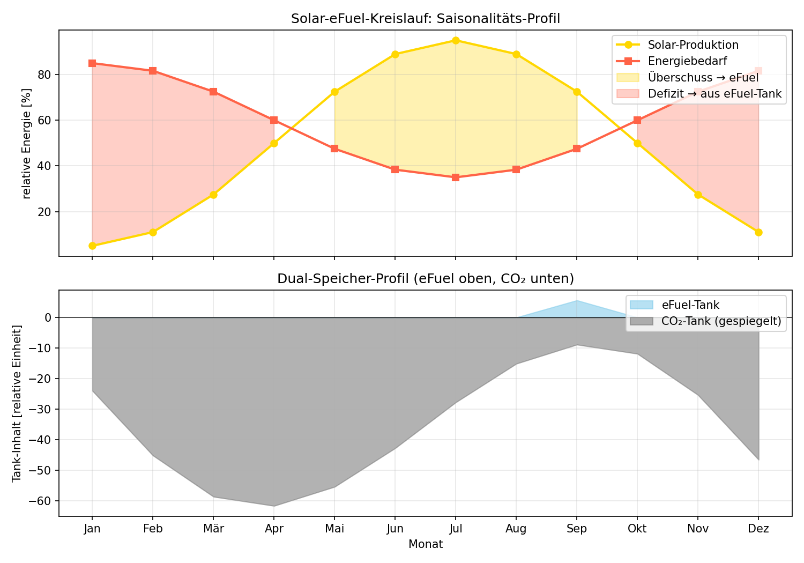
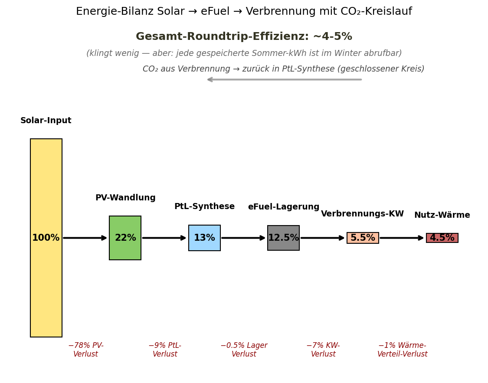

# Papier 7 — Solar-eFuel-Kreislaufwirtschaft

**Off-Grid-Reihe: Energie-Versorgung für autarke Systeme**
**Autor:** Franz Zollner (Originator) · Aufbereitung: Denker (Claude Code)
**Version:** v0.1 · **Datum:** 2026-05-14
**Lizenz:** Defensive Publication — patent-frei, Verbreitung erwünscht.

---

## TL;DR

Eine **geschlossene Kohlenstoff-Kreislauf-Architektur**, die drei Probleme
gleichzeitig löst: (1) Saisonale Solar-Überschüsse werden via Power-to-Liquid
(PtL) in eFuel gespeichert; (2) das CO₂ aus dem späteren Verbrennungs-Kraftwerk
wird abgefangen und ist Rohstoff für die nächste eFuel-Synthese; (3) die
Lagertanks dienen **dual** als Speicher für Solar-Energie UND für CO₂-Rohstoff.
Roundtrip-Effizienz nur ~4-5%, aber **jede gespeicherte Sommer-kWh ist im Winter
abrufbar** — das löst das Saisonalitäts-Problem der reinen Elektrifizierung.

---

## 1. Problem: Saisonalität der Solar-Energie

Photovoltaik produziert **im Sommer 3-5× mehr** als im Winter (je nach
Breitengrad). Aber:
- Der **Energiebedarf** ist im Winter höher (Heizung, weniger Tageslicht)
- Batterien speichern Stunden bis Tage — nicht **Monate**
- Pumpspeicher sind geographisch begrenzt
- Wasserstoff hat Lagerprobleme (Druck, Diffusion durch Stahl)

**Konsequenz:** Reine Elektrifizierung mit Solar braucht **gigantische
Übertragungs-Netze**, um Sommer-Überschüsse zu Verbrauchern zu transportieren —
ein Off-Grid-Haushalt hat das nicht.

→ **Brauche ich einen Energie-Träger, der monate-lang stabil lagerbar ist.**

---

## 2. Lösung: Solar-eFuel mit CO₂-Rückführung

### 2.1 Der Kreislauf



**Oben:** Solar-Produktion (Gelb) vs Energiebedarf (Rot) über das Jahr. Sommer:
deutlicher Überschuss (gelb gefüllt). Winter: Defizit (rot gefüllt).

**Unten:** Dual-Speicher — eFuel-Tank füllt sich im Sommer (Solar → eFuel via PtL),
CO₂-Tank füllt sich im Winter (Verbrennung erzeugt CO₂, wird abgefangen). Beide
Tanks sind antiphasig — das ist der Witz.

### 2.2 Schematischer Material-Fluss

Der Kreislauf wird durch [Mermaid-Diagramm](papier7_kreislauf.mmd) dargestellt:

```
                ☀ Solarenergie (PV)
                       │
                       ▼
              ┌─ Überschuss? ─┐
              │   JA          │  NEIN
              ▼               ▼
        ⚗ Power-to-      🏠 direkt
           Liquid          verbrauchen
            (PtL)
              │
              ▼
        🛢 eFuel-Tank
              │
              ▼ (im Winter)
        🔥 Heizkraftwerk (Verbrennung)
              │
              ├─── 🏠 Wärme + Strom für Verbraucher
              │
              ▼
        💨 CO₂-Abgas (aufgefangen)
              │
              ▼
        🛢 CO₂-Tank
              │
              └─→ zurück in PtL-Synthese (geschlossener Kreis)
```

### 2.3 Energie-Bilanz



Die Roundtrip-Effizienz (von Solar-Einstrahlung zur Nutz-Wärme) liegt bei
**~4-5%**:
- PV-Wandlung: ~22% (Solar → Strom)
- PtL-Synthese: ~60% (Strom → eFuel)
- Lagerung: ~95% (eFuel im Tank)
- Verbrennung: ~45% (eFuel → Wärme + Strom)
- Verteilung: ~90% (Wärme zum Verbraucher)
- **Gesamt: 0.22 × 0.60 × 0.95 × 0.45 × 0.90 ≈ 5%**

**Klingt wenig — aber:**
- Direkter PV-Eigenverbrauch nutzt im Sommer ~5-10% des Solar-Inputs
- Der Rest geht ins Netz, **kostet oft Geld**, oder kann nicht eingespeist werden
- Bei eFuel-Speicherung: **wird zu Winter-Wärme**, also **echter Bedarfs-Nutzen**

**Kosten-Rechnung:** Wenn Solar-Überschuss "verschenkt" wird (negative Strompreise),
ist die eFuel-Konversion **immer noch wirtschaftlich**, weil der Roh-Strom Null
oder negativ kostet.

---

## 3. Konkrete Technologie-Auswahl

### 3.1 eFuel-Variante

| eFuel | Synthese | Energiedichte | Lagerung | Anwendung |
|---|---|---|---|---|
| **Methanol (CH₃OH)** | Direct-Air-Capture + H₂ | 4.4 kWh/L | Flüssig, Standard-Tank | Auto, Schiff, Heizung |
| **DME (Dimethylether)** | Methanol → Dehydrierung | 4.2 kWh/L | wie Propan | Heizung |
| **e-Diesel (Fischer-Tropsch)** | CO₂ + H₂ → Diesel | 9.7 kWh/L | wie Diesel | Verbrennungs-Motor, Heizung |
| **Wasserstoff (H₂)** | Elektrolyse | 2.4 kWh/L (700 bar) | Druck-Tank, Diffusion | Brennstoffzelle |

**Pragmatische Wahl für Off-Grid-Haushalt:** **Methanol** — flüssig bei
Normaldruck, Standard-Stahl-Tank, vielseitig einsetzbar (Heizung + ggf. Auto +
ggf. Brennstoffzelle), CO₂-Pathway einfach (direct-air-capture machbar).

### 3.2 Dual-Speicher-Tank-Architektur

Innovation gegenüber Standard-Setup:

**Standard (zwei separate Systeme):**
```
[Solar] → [Strom-Speicher (Batterie)]
[Heizung] → [Heizöl-Tank]
[Atmosphäre] ← CO₂ aus Heizung
```

**Unser Kreislauf-Setup:**
```
[Solar] → PtL → [eFuel-Tank, doppelte Speicherrolle]
                ↓
[Heizkraftwerk Verbrennung]
                ↓
[CO₂-Tank, doppelte Speicherrolle] → zurück in PtL
```

Konkrete Maße (Beispiel Einfamilien-Haus, 4000 kWh Wärme/a):
- eFuel-Tank: ~1000 L Methanol (~4400 kWh) — vergleichbar zu klassischem Heizöl-Tank
- CO₂-Tank: ~500 L flüssiges CO₂ (200 kg) — kleinerer Druck-Tank im Keller

### 3.3 PtL-Anlage

- **Direct-Air-Capture (DAC):** CO₂ aus Umgebungsluft oder aus CO₂-Tank
- **Elektrolyse:** H₂O → H₂ + O₂ mit Solar-Strom
- **Synthese-Reaktor:** CO₂ + H₂ → CH₃OH (Methanol)
- **Skalierung:** Mini-Module ab ~5 kW (Schiffs-/Bunker-Module von z.B. Sunfire,
  Carbon Engineering, Climeworks)
- Realistische Kosten 2026: ~5-10 €/L Methanol (sinkend mit Skalierung)

---

## 4. Off-Grid-Aspekte

### 4.1 Inselbetrieb

Ein Off-Grid-Hof (Haus + Werkstatt + 1-2 Fahrzeuge) braucht typisch ~30-50 MWh/a
Gesamt-Energie. Damit:
- 30 kW PV-Anlage (ca. 200 m² Dach)
- 1500-2500 L eFuel-Speicher
- 700-1200 L CO₂-Speicher
- PtL-Modul ~10 kW

Investment-Größenordnung 2026: ~80-150 k€ (sinkend, technologisch ausgereift).

**Vorteil:** Vollständig autark, keine Anschluss-Gebühren ans Versorgernetz,
keine Strom-Preis-Schwankungen.

### 4.2 Verteilbarer Speicher

Im Gegensatz zu Lithium-Batterien (Brand-Risiko, begrenzte Zyklen): Methanol-Tanks
sind **wartungsarm, Jahrzehnte stabil**, weltweit etablierte Tank-Technologie.

### 4.3 Mehrere Höfe als Cluster

Mehrere Off-Grid-Höfe können **eFuel-Tausch** betreiben — physische Lieferung
per Tankwagen ist machbar (Methanol ist transportfähig). Das ergibt ein
dezentrales Off-Grid-Energie-Netzwerk ohne Strom-Leitungen.

---

## 5. Vergleich zu Stand-der-Technik

### Etablierte Speicher-Konzepte

| Speicher | Energiedichte | Selbstentladung | Saison-Fähig | Off-Grid |
|---|---|---|---|---|
| Li-Ion-Batterie | 0.2 kWh/L | ~3%/Monat | nein | nur kurzfristig |
| Pumpspeicher | 0.003 kWh/L | sehr gering | ja | nur mit Berg |
| Wasserstoff (700 bar) | 2.4 kWh/L | ~1%/Monat (Diffusion) | bedingt | aufwendig |
| **eFuel (Methanol)** | **4.4 kWh/L** | **<0.1%/Monat** | **ja** | **sehr gut** |
| Heizöl (Vergleich) | 10 kWh/L | <0.1%/Monat | ja | fossil |

### Existierende eFuel-Projekte

- **Audi e-fuels Pilotanlage** (Werlte, Deutschland) — synthetisches Methan
- **Carbon Engineering** (Kanada) — kommerzielle DAC-Anlagen
- **Climeworks** (Schweiz) — direct-air-capture im großen Maßstab
- **Synhelion** (Schweiz) — solare Methanol-Synthese
- **Norsk e-Fuel** (Norwegen) — e-Diesel aus Solar/Wind

### Was unser Konzept anders macht

- **Dual-Use-Tanks** — eFuel-Tank ist auch CO₂-Quellen-Tank im selben System
- **Fokus auf Haushalts-/Kleingewerbe-Skala** — die Pilotanlagen oben sind alle
  industriell, hier ist es im DIY-Bereich
- **Off-Grid-Pointe explizit:** keine Netz-Anbindung nötig

---

## 6. Anwendungsbereiche

| Anwendung | Vorteil eFuel-Kreislauf | Realisierbarkeit |
|---|---|---|
| Einfamilienhaus mit Solar | Saison-Speicher löst Winterproblem | ~3-5 Jahre |
| Bauernhof mit Fahrzeugen | eFuel ist auch Treibstoff | ~5 Jahre |
| Inselgemeinde | dezentrale Energie-Souveränität | ~10 Jahre |
| Wohnsiedlung / Quartier | gemeinsamer Tank, kleine PtL-Anlage | ~5 Jahre |
| Industriebetrieb (KMU) | Lastspitzen über Speicher abfangen | ~3 Jahre |

---

## 7. Forschungs-Ausblick

### 7.1 Bessere PtL-Wirkungsgrade

Aktuell ~60% Strom→Methanol. Mit elektrochemischer Direkt-Synthese könnten ~75-80%
erreicht werden — würde Gesamt-Roundtrip auf ~6-7% heben.

### 7.2 Hybride Speicher

eFuel für Saisonalität + Batterie für Tageszyklen + Wärme-Pufferspeicher = optimales
Zusammenspiel. Steuerung via lokales AI-System (z.B. OAE-SBC aus Papier 6 als
Energie-Management-Gerät!).

### 7.3 Bio-Reaktoren als CO₂-Senke

Statt mechanisch DAC: Algen-Reaktoren binden CO₂ und liefern Methanol-Vorstufen.
Bio-PtL als ergänzender Pfad.

### 7.4 Internationale e-Fuel-Logistik

Sonnen-reiche Länder (Marokko, Australien) produzieren e-Fuel als Export-Gut.
Klassische Tank-Schiff-Logistik kann das transportieren — wie heute Erdöl.

---

## 8. Quellen

### Originator-Beitrag (Franz Zollner)
- Tisch-Beitrag 2026-05-14: "Kopplung von Heizkraftwerken und eFuel-Generation
  angetrieben durch Solarenergie + Kreislaufwirtschaft eFuel-Tanks als Speicher
  für Solarenergie und CO₂ für eFuel-Erzeugung..."
- Dual-Use-Tank-Architektur als Pointe

### Externe Vorarbeit
- IEA, *The Future of Hydrogen* (2019) — Standard-Referenz Wasserstoff-Wirtschaft
- M. Bertau et al., *Methanol: The Basic Chemical and Energy Feedstock of the
  Future* (Springer, 2014) — Lehrbuch
- Carbon Engineering Whitepaper 2019 — DAC-Technologie
- Audi e-fuels Datenblätter — Pilot-Anlagen-Specs

### Verwandte Konzepte

- **Power-to-X** (Synhelion, Carbon Engineering, Climeworks)
- **Methanol-Wirtschaft** (Olah, Goeppert)
- **Hybride Erneuerbare** (Wind + Solar + Speicher)

### Cross-Refs in dieser Sammlung

- **Papier 6** liefert das Gehirn (Energie-Management via OAE-SBC denkbar)
- **Off-Grid-Charakter** ist gemeinsamer Nenner aller 7 Papiere

---

## 9. Defensive-Publication-Hinweis

Dieses Konzept wird **bewusst patent-frei** veröffentlicht. Die Beschreibung
dient als prior art. Wer das Konzept umsetzt: gerne — und ohne Lizenz-Gebühren.

---

## 10. Zitieren & Unterstützen

Wenn dieses Konzept dir nützt:
- **Zitiere es** (Zenodo-DOI folgt nach Upload; bis dahin: URL des Repos)
- ☕ Kaffee: *(URL noch zu setzen)*
- 🛠 Substantieller: *(URL noch zu setzen)*

Anders als bei **GEMA-pflichtigen Inhalten** gibt es hier keine Lizenz-Falle —
die Verbreitung ist erwünscht.

---

*Erstellt im Rahmen der Off-Grid-Reihe 2026-05-14. Feedback willkommen.*
*Letztes Papier der Reihe (von 7).*
